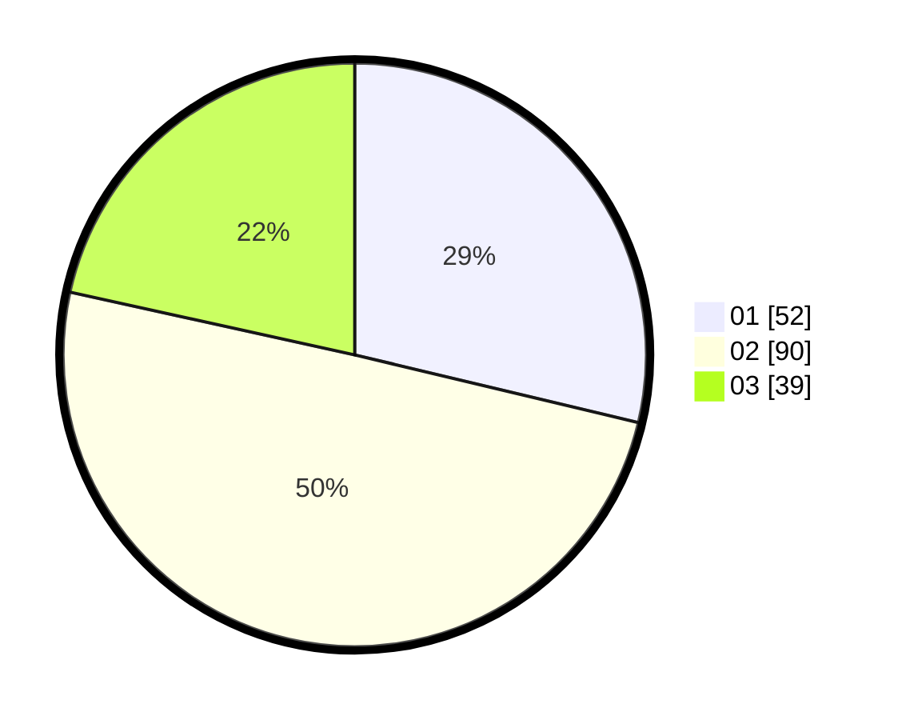

# Hasil

Hasil perolehan suara paslon dapat dilihat pada file paslon-01.txt, paslon-02.txt, dan paslon-03.txt.

Jika tidak ada, artinya data tersebut belum ada pada SIREKAP.

## Perolehan Suara

 * Paslon 01: **52**.
 * Paslon 02: **90**.
 * Paslon 03: **39**.

## Foto C Plano

https://sirekap-obj-formc.kpu.go.id/bdbb/pemilu/ppwp/31/73/02/10/04/3173021004076-20240214-204828--9b1e8e37-d73f-4a6c-bea7-e64a37482104.jpg

https://sirekap-obj-formc.kpu.go.id/bdbb/pemilu/ppwp/31/73/02/10/04/3173021004076-20240214-213824--9dca6e32-5d2b-4ac2-8044-6a1e5dca4444.jpg

https://sirekap-obj-formc.kpu.go.id/bdbb/pemilu/ppwp/31/73/02/10/04/3173021004076-20240214-204946--a739dc38-427a-4ffc-93b9-fd0a99771ae6.jpg
