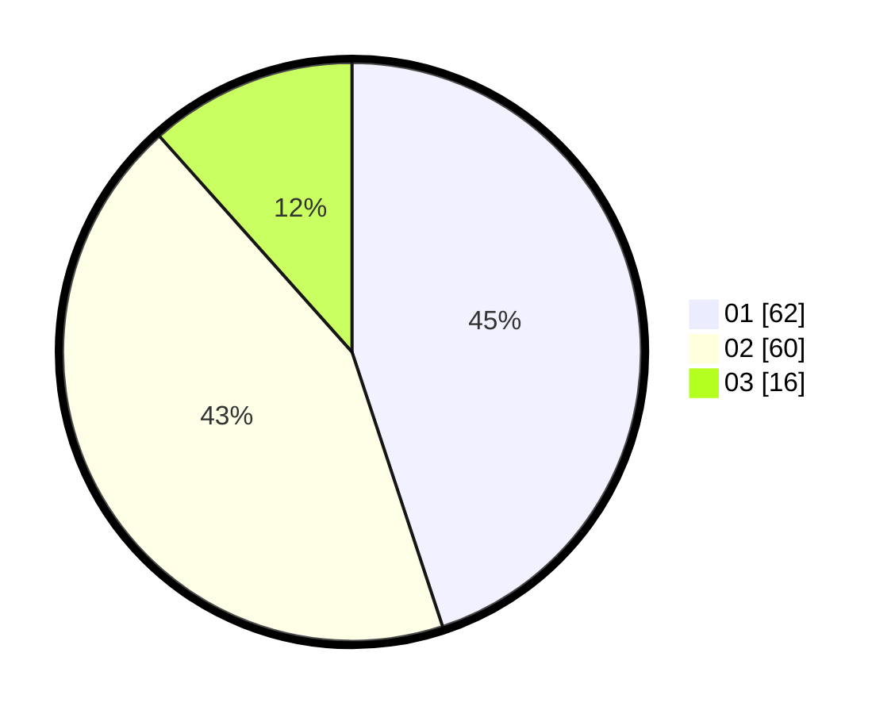

# Hasil

Hasil perolehan suara paslon dapat dilihat pada file paslon-01.txt, paslon-02.txt, dan paslon-03.txt.

Jika tidak ada, artinya data tersebut belum ada pada SIREKAP.

## Perolehan Suara

 * Paslon 01: **62**.
 * Paslon 02: **60**.
 * Paslon 03: **16**.

## Foto C Plano

https://sirekap-obj-formc.kpu.go.id/dbc7/pemilu/ppwp/31/73/02/10/04/3173021004083-20240214-192957--926b1403-b3be-48f0-8525-147eede81025.jpg

https://sirekap-obj-formc.kpu.go.id/dbc7/pemilu/ppwp/31/73/02/10/04/3173021004083-20240214-193052--b996a423-88dd-432a-acb2-6fbba72c3c5a.jpg

https://sirekap-obj-formc.kpu.go.id/dbc7/pemilu/ppwp/31/73/02/10/04/3173021004083-20240214-192815--40a2fe6b-d44a-485e-994b-4ccc7988e8db.jpg
