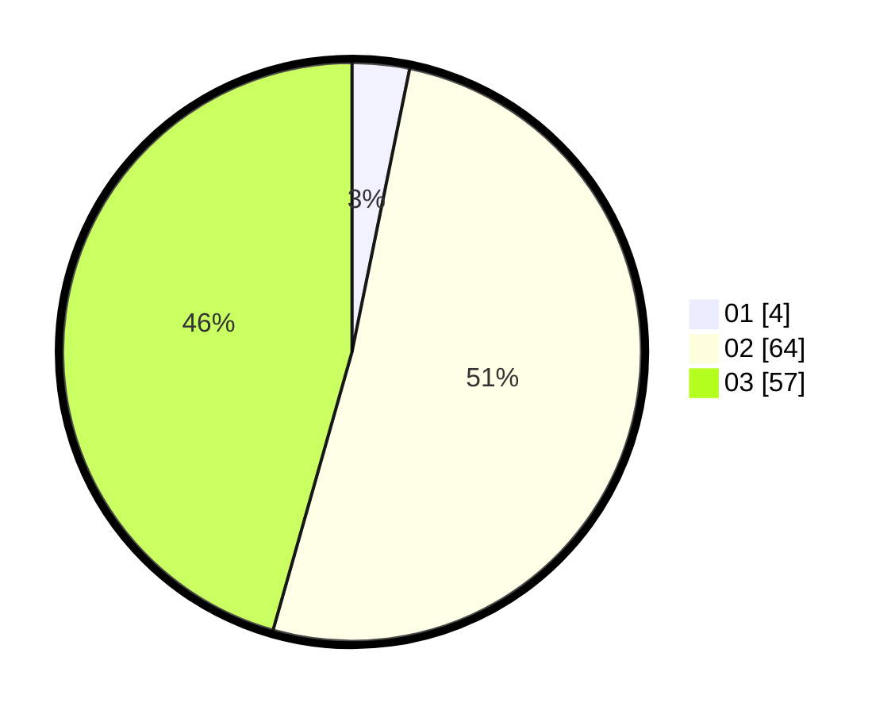

# Hasil

Hasil perolehan suara paslon dapat dilihat pada file paslon-01.txt, paslon-02.txt, dan paslon-03.txt.

Jika tidak ada, artinya data tersebut belum ada pada SIREKAP.

## Perolehan Suara

 * Paslon 01: **4**.
 * Paslon 02: **64**.
 * Paslon 03: **57**.

## Foto C Plano

https://sirekap-obj-formc.kpu.go.id/0d14/pemilu/ppwp/31/73/02/10/04/3173021004091-20240214-211707--b5cd2d73-3b03-47ee-9965-77ea22355b75.jpg

https://sirekap-obj-formc.kpu.go.id/0d14/pemilu/ppwp/31/73/02/10/04/3173021004091-20240214-211333--7c3f75b9-8d03-44fc-83db-c81188b3199a.jpg

https://sirekap-obj-formc.kpu.go.id/0d14/pemilu/ppwp/31/73/02/10/04/3173021004091-20240214-211419--64cb5f84-9963-4049-b234-20e509df0087.jpg
