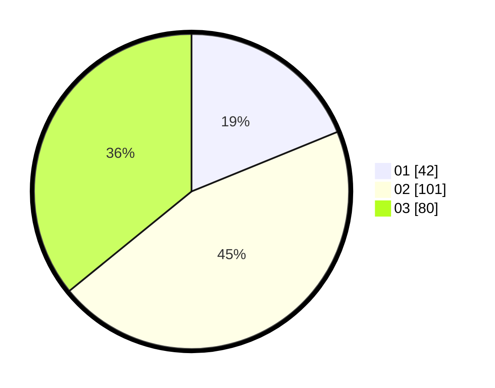

# Hasil

Hasil perolehan suara paslon dapat dilihat pada file paslon-01.txt, paslon-02.txt, dan paslon-03.txt.

Jika tidak ada, artinya data tersebut belum ada pada SIREKAP.

## Perolehan Suara

 * Paslon 01: **42**.
 * Paslon 02: **101**.
 * Paslon 03: **80**.

## Foto C Plano

https://sirekap-obj-formc.kpu.go.id/9faa/pemilu/ppwp/31/73/02/10/04/3173021004092-20240215-211546--45ea767d-f04a-4008-b7e3-77b44f7e816d.jpg

https://sirekap-obj-formc.kpu.go.id/9faa/pemilu/ppwp/31/73/02/10/04/3173021004092-20240215-211549--fefefd2b-41df-485a-9cda-5a16ccbc3b48.jpg

https://sirekap-obj-formc.kpu.go.id/9faa/pemilu/ppwp/31/73/02/10/04/3173021004092-20240215-211548--54076829-9055-4982-8a04-b821ba9b9a86.jpg

## DATA PEMILIH TETAP

Jumlah pemilih dalam DPT: **278**.
 * L: **125**.
 * P: **153**.

## DATA PENGGUNA HAK PILIH

Jumlah pengguna hak pilih dalam DPT: **219**.
 * L: **94**.
 * P: **125**.

Jumlah pengguna hak pilih dalam DPTb: **2**.
 * L: **1**.
 * P: **1**.

Jumlah pengguna hak pilih dalam DPK: **3**.
 * L: **0**.
 * P: **3**.

Jumlah pengguna hak pilih: **224**.
 * L: **95**.
 * P: **129**.

## JUMLAH SUARA SAH DAN TIDAK SAH

JUMLAH SELURUH SUARA SAH: **223**.

JUMLAH SUARA TIDAK SAH: **1**.

JUMLAH SELURUH SUARA SAH DAN SUARA TIDAK SAH: **224**.
