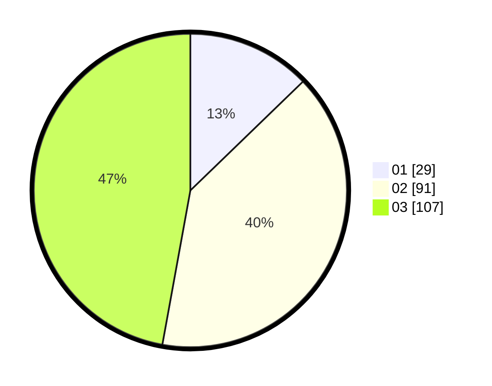

# Hasil

Hasil perolehan suara paslon dapat dilihat pada file paslon-01.txt, paslon-02.txt, dan paslon-03.txt.

Jika tidak ada, artinya data tersebut belum ada pada SIREKAP.

## Perolehan Suara

 * Paslon 01: **29**.
 * Paslon 02: **91**.
 * Paslon 03: **107**.

## Foto C Plano

https://sirekap-obj-formc.kpu.go.id/beed/pemilu/ppwp/31/73/02/10/04/3173021004094-20240216-144926--3d84a3d0-cb64-4450-b8c0-8f46d47a405c.jpg

https://sirekap-obj-formc.kpu.go.id/beed/pemilu/ppwp/31/73/02/10/04/3173021004094-20240216-144928--e364e148-a89e-4ad3-be42-3f9fdafe3e53.jpg

https://sirekap-obj-formc.kpu.go.id/beed/pemilu/ppwp/31/73/02/10/04/3173021004094-20240216-144927--25ca35b9-4e58-4851-b582-32b0c2375a09.jpg

## DATA PEMILIH TETAP

Jumlah pemilih dalam DPT: **284**.
 * L: **134**.
 * P: **150**.

## DATA PENGGUNA HAK PILIH

Jumlah pengguna hak pilih dalam DPT: **222**.
 * L: **111**.
 * P: **111**.

Jumlah pengguna hak pilih dalam DPTb: **0**.
 * L: **0**.
 * P: **0**.

Jumlah pengguna hak pilih dalam DPK: **5**.
 * L: **3**.
 * P: **2**.

Jumlah pengguna hak pilih: **227**.
 * L: **114**.
 * P: **113**.

## JUMLAH SUARA SAH DAN TIDAK SAH

JUMLAH SELURUH SUARA SAH: **227**.

JUMLAH SUARA TIDAK SAH: **0**.

JUMLAH SELURUH SUARA SAH DAN SUARA TIDAK SAH: **227**.
