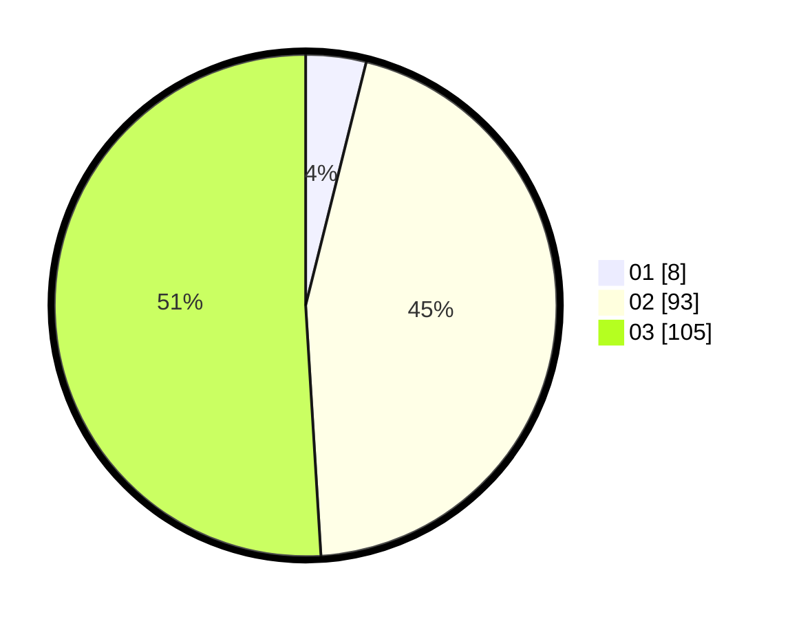

# Hasil

Hasil perolehan suara paslon dapat dilihat pada file paslon-01.txt, paslon-02.txt, dan paslon-03.txt.

Jika tidak ada, artinya data tersebut belum ada pada SIREKAP.

## Perolehan Suara

 * Paslon 01: **8**.
 * Paslon 02: **93**.
 * Paslon 03: **105**.

## Foto C Plano

https://sirekap-obj-formc.kpu.go.id/c996/pemilu/ppwp/31/73/02/10/04/3173021004096-20240214-235751--038d0856-75a3-4aff-8cff-b8d2429cfe2c.jpg

https://sirekap-obj-formc.kpu.go.id/c996/pemilu/ppwp/31/73/02/10/04/3173021004096-20240214-235810--52172229-afb8-4fa0-b3ff-36db4bdeb00d.jpg

https://sirekap-obj-formc.kpu.go.id/c996/pemilu/ppwp/31/73/02/10/04/3173021004096-20240214-235817--5e3d35fc-8c71-4edc-857b-0d7bea190c97.jpg
