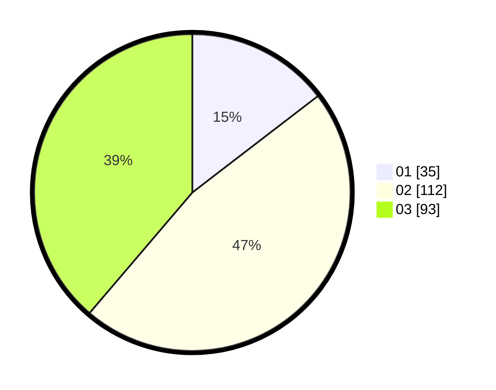

# Hasil

Hasil perolehan suara paslon dapat dilihat pada file paslon-01.txt, paslon-02.txt, dan paslon-03.txt.

Jika tidak ada, artinya data tersebut belum ada pada SIREKAP.

## Perolehan Suara

 * Paslon 01: **35**.
 * Paslon 02: **112**.
 * Paslon 03: **93**.

## Foto C Plano

https://sirekap-obj-formc.kpu.go.id/a897/pemilu/ppwp/31/73/02/10/04/3173021004099-20240214-230235--332b2917-72b6-46ef-b425-b5d3620079eb.jpg

https://sirekap-obj-formc.kpu.go.id/a897/pemilu/ppwp/31/73/02/10/04/3173021004099-20240214-230431--43dfe96f-3052-4b15-9819-83169b7a43e2.jpg

https://sirekap-obj-formc.kpu.go.id/a897/pemilu/ppwp/31/73/02/10/04/3173021004099-20240214-230609--ff1e588c-a7a3-4d24-9847-aca778b5003a.jpg
