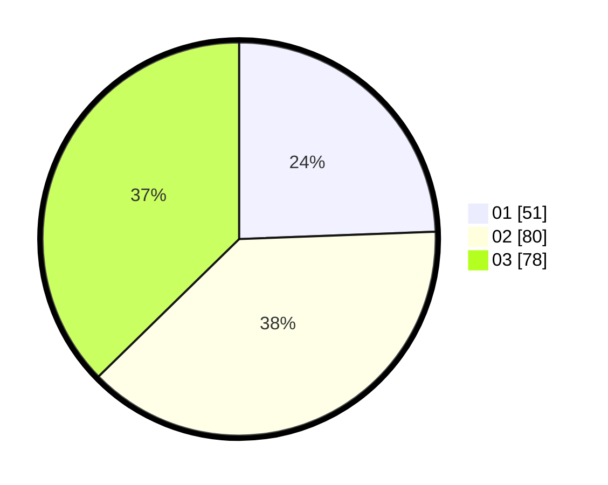

# Hasil

Hasil perolehan suara paslon dapat dilihat pada file paslon-01.txt, paslon-02.txt, dan paslon-03.txt.

Jika tidak ada, artinya data tersebut belum ada pada SIREKAP.

## Perolehan Suara

 * Paslon 01: **51**.
 * Paslon 02: **80**.
 * Paslon 03: **78**.

## Foto C Plano

https://sirekap-obj-formc.kpu.go.id/2b84/pemilu/ppwp/31/73/02/10/04/3173021004100-20240214-235954--f6719cf4-8784-4d44-a144-ed944461844d.jpg

https://sirekap-obj-formc.kpu.go.id/2b84/pemilu/ppwp/31/73/02/10/04/3173021004100-20240215-000307--64ff38b4-c7f0-4a6f-93b7-9ada89909ffc.jpg
