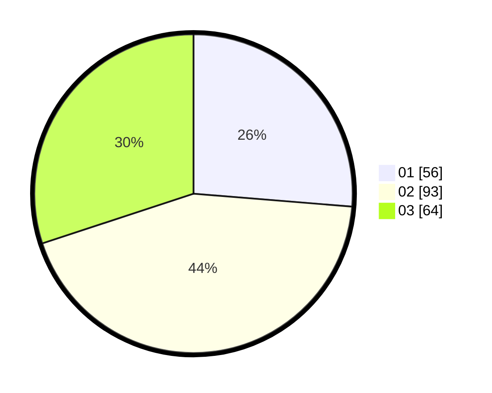

# Hasil

Hasil perolehan suara paslon dapat dilihat pada file paslon-01.txt, paslon-02.txt, dan paslon-03.txt.

Jika tidak ada, artinya data tersebut belum ada pada SIREKAP.

## Perolehan Suara

 * Paslon 01: **56**.
 * Paslon 02: **93**.
 * Paslon 03: **64**.

## Foto C Plano

https://sirekap-obj-formc.kpu.go.id/d76f/pemilu/ppwp/31/73/02/10/04/3173021004101-20240214-191021--832ede59-bff0-4d7e-a238-9c715dd85c55.jpg

https://sirekap-obj-formc.kpu.go.id/d76f/pemilu/ppwp/31/73/02/10/04/3173021004101-20240214-191042--3f768bb8-6277-46d7-aa88-b824209af96e.jpg

https://sirekap-obj-formc.kpu.go.id/d76f/pemilu/ppwp/31/73/02/10/04/3173021004101-20240214-192121--efdd979d-67a5-42ea-971a-ff449294cc12.jpg

## DATA PEMILIH TETAP

Jumlah pemilih dalam DPT: **268**.
 * L: **126**.
 * P: **142**.

## DATA PENGGUNA HAK PILIH

Jumlah pengguna hak pilih dalam DPT: **210**.
 * L: **98**.
 * P: **112**.

Jumlah pengguna hak pilih dalam DPTb: **4**.
 * L: **1**.
 * P: **3**.

Jumlah pengguna hak pilih dalam DPK: **1**.
 * L: **0**.
 * P: **1**.

Jumlah pengguna hak pilih: **215**.
 * L: **99**.
 * P: **116**.

## JUMLAH SUARA SAH DAN TIDAK SAH

JUMLAH SELURUH SUARA SAH: **213**.

JUMLAH SUARA TIDAK SAH: **2**.

JUMLAH SELURUH SUARA SAH DAN SUARA TIDAK SAH: **215**.
