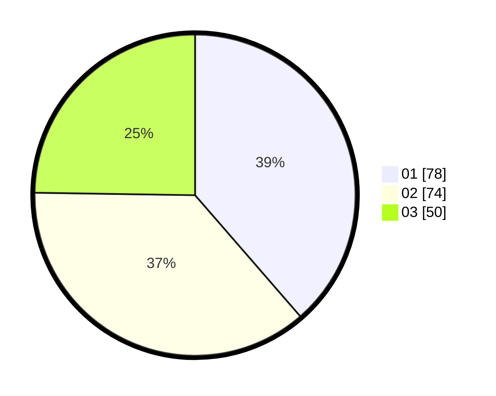

# Hasil

Hasil perolehan suara paslon dapat dilihat pada file paslon-01.txt, paslon-02.txt, dan paslon-03.txt.

Jika tidak ada, artinya data tersebut belum ada pada SIREKAP.

## Perolehan Suara

 * Paslon 01: **78**.
 * Paslon 02: **74**.
 * Paslon 03: **50**.

## Foto C Plano

https://sirekap-obj-formc.kpu.go.id/2156/pemilu/ppwp/31/73/02/10/05/3173021005001-20240216-030458--b8092b8e-9376-41eb-b35d-73daf987fc83.jpg

https://sirekap-obj-formc.kpu.go.id/2156/pemilu/ppwp/31/73/02/10/05/3173021005001-20240216-030506--2c73b8c7-ddf4-4348-b8d3-d0b9677772cc.jpg

https://sirekap-obj-formc.kpu.go.id/2156/pemilu/ppwp/31/73/02/10/05/3173021005001-20240216-030459--a53107a5-634f-43f4-b633-1471e95ec860.jpg

## DATA PEMILIH TETAP

Jumlah pemilih dalam DPT: **273**.
 * L: **124**.
 * P: **149**.

## DATA PENGGUNA HAK PILIH

Jumlah pengguna hak pilih dalam DPT: **184**.
 * L: **85**.
 * P: **99**.

Jumlah pengguna hak pilih dalam DPTb: **16**.
 * L: **8**.
 * P: **8**.

Jumlah pengguna hak pilih dalam DPK: **2**.
 * L: **1**.
 * P: **1**.

Jumlah pengguna hak pilih: **202**.
 * L: **94**.
 * P: **108**.

## JUMLAH SUARA SAH DAN TIDAK SAH

JUMLAH SELURUH SUARA SAH: **202**.

JUMLAH SUARA TIDAK SAH: **0**.

JUMLAH SELURUH SUARA SAH DAN SUARA TIDAK SAH: **202**.
