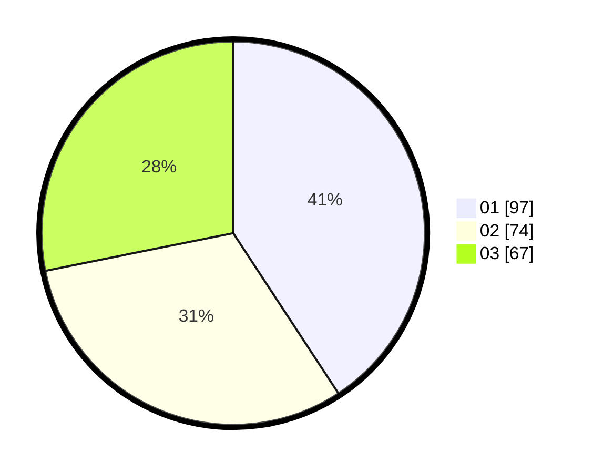

# Hasil

Hasil perolehan suara paslon dapat dilihat pada file paslon-01.txt, paslon-02.txt, dan paslon-03.txt.

Jika tidak ada, artinya data tersebut belum ada pada SIREKAP.

## Perolehan Suara

 * Paslon 01: **97**.
 * Paslon 02: **74**.
 * Paslon 03: **67**.

## Foto C Plano

https://sirekap-obj-formc.kpu.go.id/92fd/pemilu/ppwp/31/73/02/10/05/3173021005004-20240214-234224--e95e4961-f0d8-4172-a7c9-016b7a6c97c3.jpg

https://sirekap-obj-formc.kpu.go.id/92fd/pemilu/ppwp/31/73/02/10/05/3173021005004-20240215-094126--b0cbb330-7852-4cd1-b027-af596160cab2.jpg

https://sirekap-obj-formc.kpu.go.id/92fd/pemilu/ppwp/31/73/02/10/05/3173021005004-20240214-234453--f8249523-7a63-43a0-a271-d2d7345be13e.jpg
