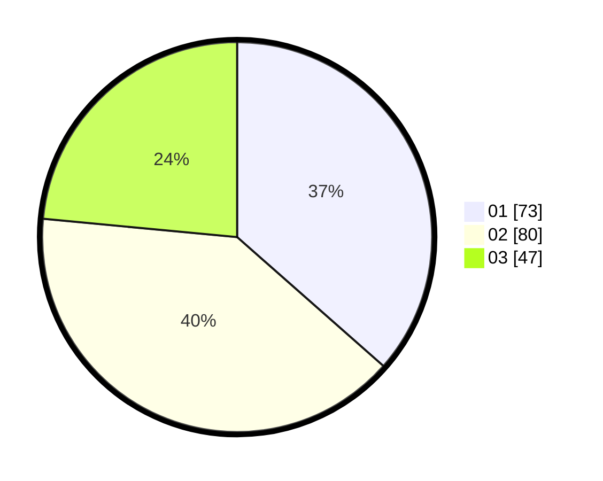

# Hasil

Hasil perolehan suara paslon dapat dilihat pada file paslon-01.txt, paslon-02.txt, dan paslon-03.txt.

Jika tidak ada, artinya data tersebut belum ada pada SIREKAP.

## Perolehan Suara

 * Paslon 01: **73**.
 * Paslon 02: **80**.
 * Paslon 03: **47**.

## Foto C Plano

https://sirekap-obj-formc.kpu.go.id/fe75/pemilu/ppwp/31/73/02/10/05/3173021005008-20240214-212921--dc74d3a6-0ed1-473e-aacb-dca3870ec5a0.jpg

https://sirekap-obj-formc.kpu.go.id/fe75/pemilu/ppwp/31/73/02/10/05/3173021005008-20240214-213023--ff1d40c8-b8f5-42ae-bec9-45b4904287e7.jpg

https://sirekap-obj-formc.kpu.go.id/fe75/pemilu/ppwp/31/73/02/10/05/3173021005008-20240214-213121--f3779e0d-2f27-4be0-87a4-cadaeb207e64.jpg
