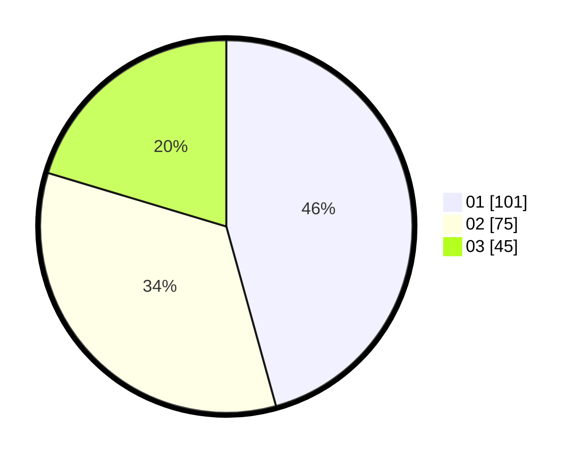

# Hasil

Hasil perolehan suara paslon dapat dilihat pada file paslon-01.txt, paslon-02.txt, dan paslon-03.txt.

Jika tidak ada, artinya data tersebut belum ada pada SIREKAP.

## Perolehan Suara

 * Paslon 01: **101**.
 * Paslon 02: **75**.
 * Paslon 03: **45**.

## Foto C Plano

https://sirekap-obj-formc.kpu.go.id/e8c7/pemilu/ppwp/31/73/02/10/05/3173021005011-20240215-175422--aa9dcb2e-ec65-4dbf-9145-65c852680c1a.jpg

https://sirekap-obj-formc.kpu.go.id/e8c7/pemilu/ppwp/31/73/02/10/05/3173021005011-20240215-175428--b587ac80-2b3b-4bff-b80e-f02c2894a642.jpg

https://sirekap-obj-formc.kpu.go.id/e8c7/pemilu/ppwp/31/73/02/10/05/3173021005011-20240215-175436--47dc5d36-52ab-4dc3-b285-4ae0cf9249b4.jpg
