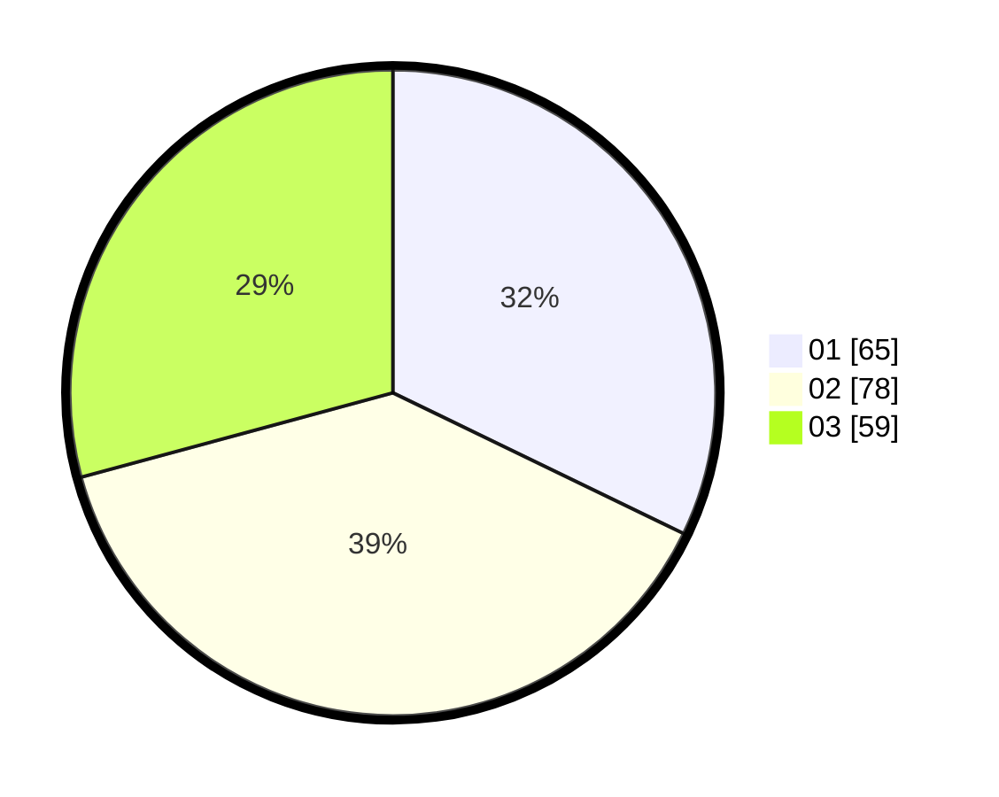

# Hasil

Hasil perolehan suara paslon dapat dilihat pada file paslon-01.txt, paslon-02.txt, dan paslon-03.txt.

Jika tidak ada, artinya data tersebut belum ada pada SIREKAP.

## Perolehan Suara

 * Paslon 01: **65**.
 * Paslon 02: **78**.
 * Paslon 03: **59**.

## Foto C Plano

https://sirekap-obj-formc.kpu.go.id/38c7/pemilu/ppwp/31/73/02/10/05/3173021005012-20240215-003600--6eedebf3-d586-45df-a1cd-d9a511e67ea3.jpg

https://sirekap-obj-formc.kpu.go.id/38c7/pemilu/ppwp/31/73/02/10/05/3173021005012-20240215-002554--7eae98f5-3dd6-4cce-b797-4b8595cddd03.jpg

https://sirekap-obj-formc.kpu.go.id/38c7/pemilu/ppwp/31/73/02/10/05/3173021005012-20240215-003644--12752a2d-cec1-423b-8447-7079986d5d4c.jpg

## DATA PEMILIH TETAP

Jumlah pemilih dalam DPT: **270**.
 * L: **132**.
 * P: **138**.

## DATA PENGGUNA HAK PILIH

Jumlah pengguna hak pilih dalam DPT: **184**.
 * L: **91**.
 * P: **93**.

Jumlah pengguna hak pilih dalam DPTb: **18**.
 * L: **4**.
 * P: **14**.

Jumlah pengguna hak pilih dalam DPK: **5**.
 * L: **3**.
 * P: **2**.

Jumlah pengguna hak pilih: **207**.
 * L: **98**.
 * P: **109**.

## JUMLAH SUARA SAH DAN TIDAK SAH

JUMLAH SELURUH SUARA SAH: **202**.

JUMLAH SUARA TIDAK SAH: **5**.

JUMLAH SELURUH SUARA SAH DAN SUARA TIDAK SAH: **207**.
