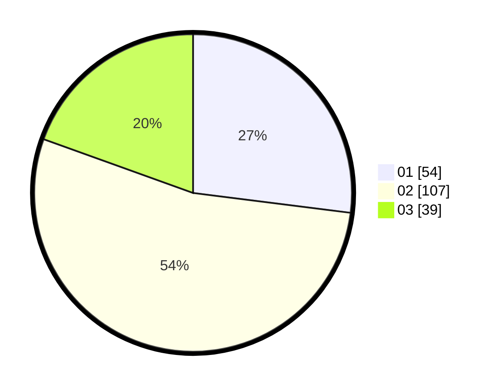

# Hasil

Hasil perolehan suara paslon dapat dilihat pada file paslon-01.txt, paslon-02.txt, dan paslon-03.txt.

Jika tidak ada, artinya data tersebut belum ada pada SIREKAP.

## Perolehan Suara

 * Paslon 01: **54**.
 * Paslon 02: **107**.
 * Paslon 03: **39**.

## Foto C Plano

https://sirekap-obj-formc.kpu.go.id/3890/pemilu/ppwp/31/73/02/10/05/3173021005014-20240214-214849--43e13ff8-3244-406b-8b8c-c5304cb763b1.jpg

https://sirekap-obj-formc.kpu.go.id/3890/pemilu/ppwp/31/73/02/10/05/3173021005014-20240214-214145--402f0152-b91b-468c-a098-a12d6ca59292.jpg

https://sirekap-obj-formc.kpu.go.id/3890/pemilu/ppwp/31/73/02/10/05/3173021005014-20240214-215008--7b1480d6-3948-4296-a678-3a3463575287.jpg
