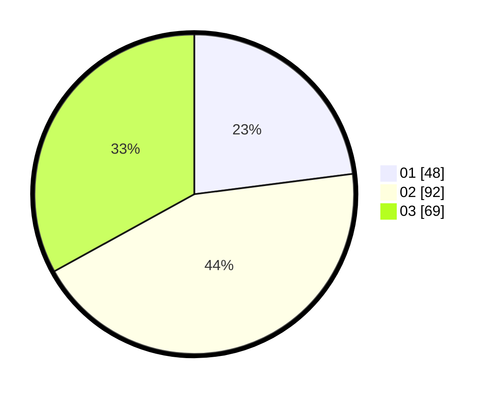

# Hasil

Hasil perolehan suara paslon dapat dilihat pada file paslon-01.txt, paslon-02.txt, dan paslon-03.txt.

Jika tidak ada, artinya data tersebut belum ada pada SIREKAP.

## Perolehan Suara

 * Paslon 01: **48**.
 * Paslon 02: **92**.
 * Paslon 03: **69**.

## Foto C Plano

https://sirekap-obj-formc.kpu.go.id/a152/pemilu/ppwp/31/73/02/10/05/3173021005020-20240214-192336--83e6fb8d-849d-4e34-8213-6eb33dd131f9.jpg

https://sirekap-obj-formc.kpu.go.id/a152/pemilu/ppwp/31/73/02/10/05/3173021005020-20240214-192344--16ad5531-cc4b-4b3e-812e-20ada603a567.jpg

https://sirekap-obj-formc.kpu.go.id/a152/pemilu/ppwp/31/73/02/10/05/3173021005020-20240214-192357--fb117465-6f16-4a75-85dd-23ad1306c5de.jpg
