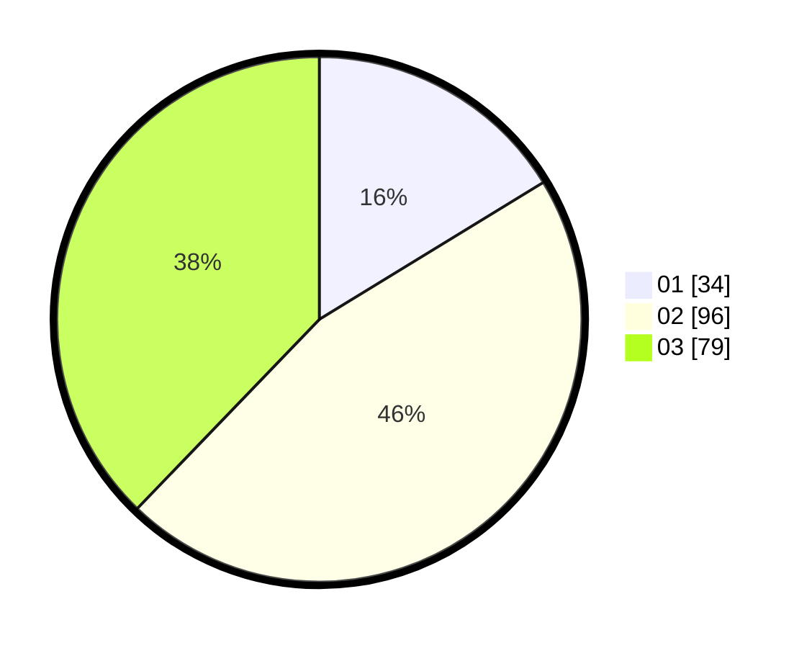

# Hasil

Hasil perolehan suara paslon dapat dilihat pada file paslon-01.txt, paslon-02.txt, dan paslon-03.txt.

Jika tidak ada, artinya data tersebut belum ada pada SIREKAP.

## Perolehan Suara

 * Paslon 01: **34**.
 * Paslon 02: **96**.
 * Paslon 03: **79**.

## Foto C Plano

https://sirekap-obj-formc.kpu.go.id/36dd/pemilu/ppwp/31/73/02/10/05/3173021005026-20240214-230349--7e676e99-63d3-495d-8966-67736fc17037.jpg

https://sirekap-obj-formc.kpu.go.id/36dd/pemilu/ppwp/31/73/02/10/05/3173021005026-20240214-230352--a10cfa41-cf2c-4d24-9ce6-7d27b9cc1f4f.jpg

https://sirekap-obj-formc.kpu.go.id/36dd/pemilu/ppwp/31/73/02/10/05/3173021005026-20240214-230358--930b777c-386d-4658-a073-98d0d84390cf.jpg
