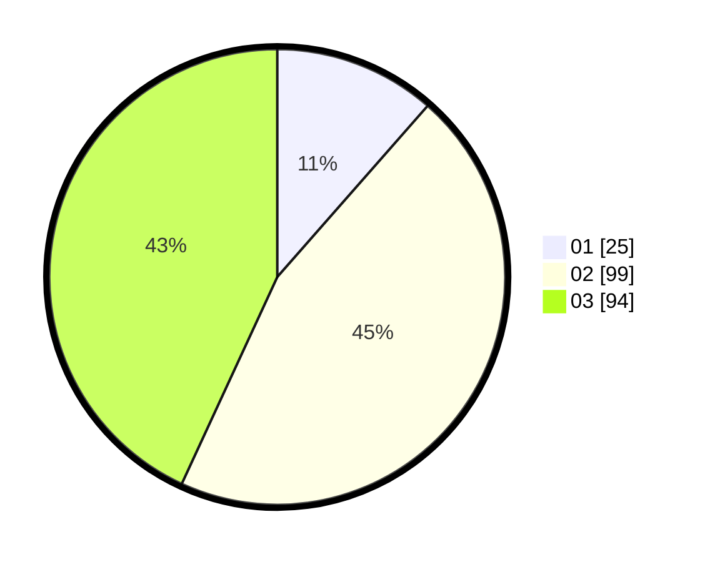

# Hasil

Hasil perolehan suara paslon dapat dilihat pada file paslon-01.txt, paslon-02.txt, dan paslon-03.txt.

Jika tidak ada, artinya data tersebut belum ada pada SIREKAP.

## Perolehan Suara

 * Paslon 01: **25**.
 * Paslon 02: **99**.
 * Paslon 03: **94**.

## Foto C Plano

https://sirekap-obj-formc.kpu.go.id/e42e/pemilu/ppwp/31/73/02/10/05/3173021005028-20240215-032236--6f187962-08cf-47a7-b545-c8a04801b196.jpg

https://sirekap-obj-formc.kpu.go.id/e42e/pemilu/ppwp/31/73/02/10/05/3173021005028-20240215-032154--8dd50565-ccdc-4040-a718-234530acf75e.jpg
