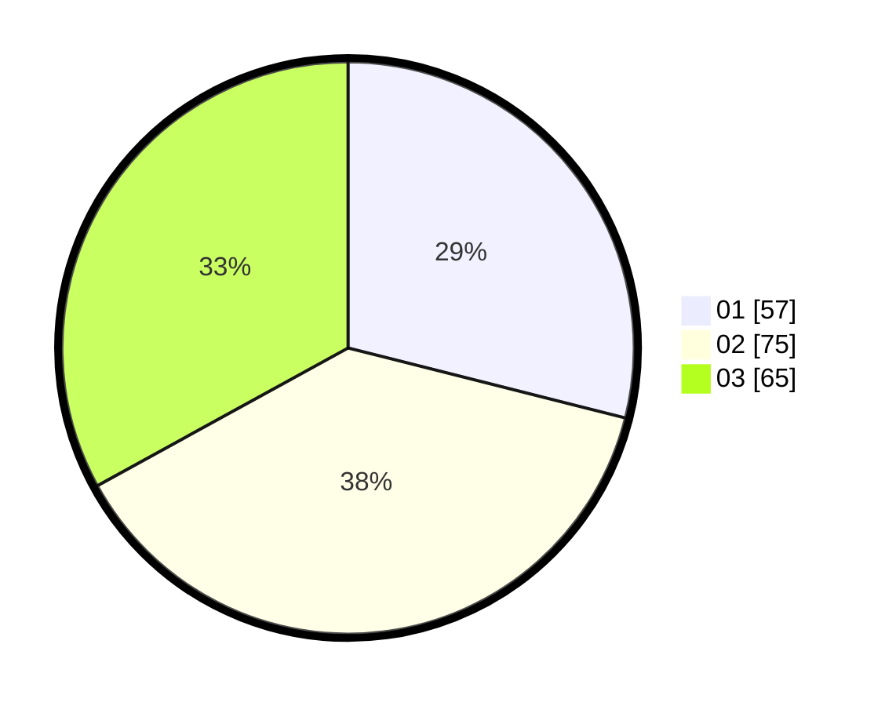

# Hasil

Hasil perolehan suara paslon dapat dilihat pada file paslon-01.txt, paslon-02.txt, dan paslon-03.txt.

Jika tidak ada, artinya data tersebut belum ada pada SIREKAP.

## Perolehan Suara

 * Paslon 01: **57**.
 * Paslon 02: **75**.
 * Paslon 03: **65**.

## Foto C Plano

https://sirekap-obj-formc.kpu.go.id/320e/pemilu/ppwp/31/73/02/10/05/3173021005039-20240216-095124--90da5d35-831d-4cc9-aed1-f7dab6cb1faf.jpg

https://sirekap-obj-formc.kpu.go.id/320e/pemilu/ppwp/31/73/02/10/05/3173021005039-20240216-084957--30e22868-313b-435f-abbf-caaea5e8d39c.jpg

https://sirekap-obj-formc.kpu.go.id/320e/pemilu/ppwp/31/73/02/10/05/3173021005039-20240216-084953--ff5c9dac-2eac-484f-aeb9-59bb1824c870.jpg

## DATA PEMILIH TETAP

Jumlah pemilih dalam DPT: **275**.
 * L: **136**.
 * P: **139**.

## DATA PENGGUNA HAK PILIH

Jumlah pengguna hak pilih dalam DPT: **181**.
 * L: **86**.
 * P: **95**.

Jumlah pengguna hak pilih dalam DPTb: **14**.
 * L: **5**.
 * P: **9**.

Jumlah pengguna hak pilih dalam DPK: **4**.
 * L: **1**.
 * P: **3**.

Jumlah pengguna hak pilih: **199**.
 * L: **92**.
 * P: **107**.

## JUMLAH SUARA SAH DAN TIDAK SAH

JUMLAH SELURUH SUARA SAH: **197**.

JUMLAH SUARA TIDAK SAH: **2**.

JUMLAH SELURUH SUARA SAH DAN SUARA TIDAK SAH: **199**.
