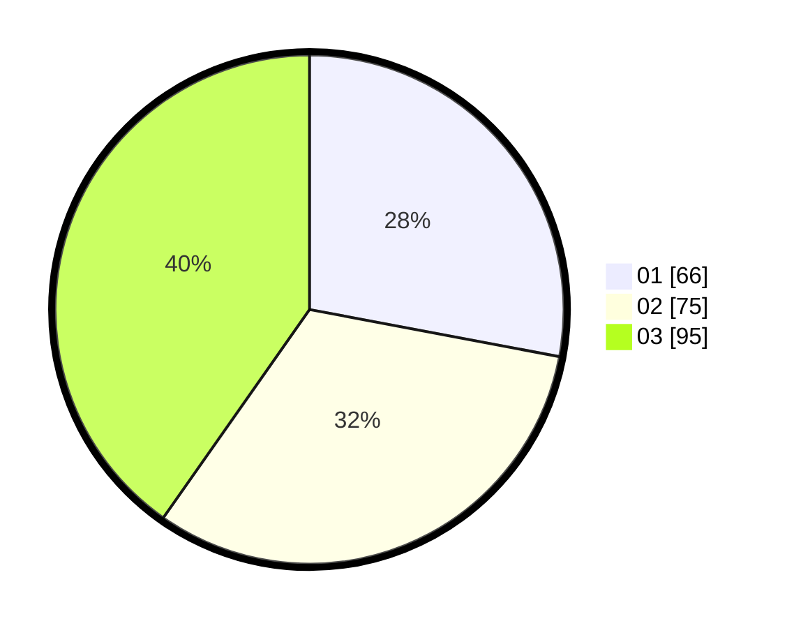

# Hasil

Hasil perolehan suara paslon dapat dilihat pada file paslon-01.txt, paslon-02.txt, dan paslon-03.txt.

Jika tidak ada, artinya data tersebut belum ada pada SIREKAP.

## Perolehan Suara

 * Paslon 01: **66**.
 * Paslon 02: **75**.
 * Paslon 03: **95**.

## Foto C Plano

https://sirekap-obj-formc.kpu.go.id/412e/pemilu/ppwp/31/73/02/10/05/3173021005041-20240215-010610--26ea382f-c348-4937-ad47-6679ff817a27.jpg

https://sirekap-obj-formc.kpu.go.id/412e/pemilu/ppwp/31/73/02/10/05/3173021005041-20240215-010713--81c4420b-9dd4-4d22-b539-d14bb4be8a3e.jpg

https://sirekap-obj-formc.kpu.go.id/412e/pemilu/ppwp/31/73/02/10/05/3173021005041-20240215-010741--f20eed21-ed57-4130-8a9e-4c3ef2ab8e32.jpg

## DATA PEMILIH TETAP

Jumlah pemilih dalam DPT: **292**.
 * L: **139**.
 * P: **153**.

## DATA PENGGUNA HAK PILIH

Jumlah pengguna hak pilih dalam DPT: **225**.
 * L: **103**.
 * P: **122**.

Jumlah pengguna hak pilih dalam DPTb: **14**.
 * L: **3**.
 * P: **11**.

Jumlah pengguna hak pilih dalam DPK: **1**.
 * L: **1**.
 * P: **0**.

Jumlah pengguna hak pilih: **240**.
 * L: **107**.
 * P: **133**.

## JUMLAH SUARA SAH DAN TIDAK SAH

JUMLAH SELURUH SUARA SAH: **236**.

JUMLAH SUARA TIDAK SAH: **4**.

JUMLAH SELURUH SUARA SAH DAN SUARA TIDAK SAH: **240**.
