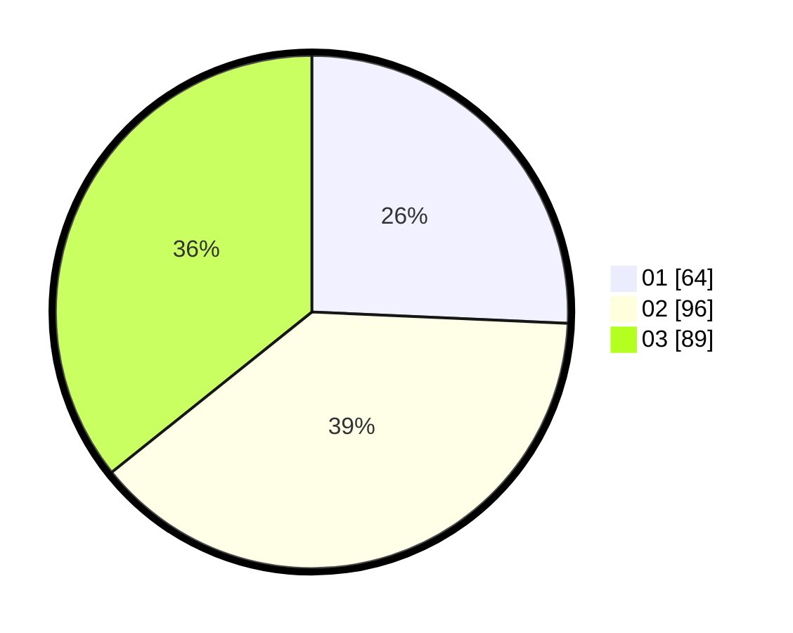

# Hasil

Hasil perolehan suara paslon dapat dilihat pada file paslon-01.txt, paslon-02.txt, dan paslon-03.txt.

Jika tidak ada, artinya data tersebut belum ada pada SIREKAP.

## Perolehan Suara

 * Paslon 01: **64**.
 * Paslon 02: **96**.
 * Paslon 03: **89**.

## Foto C Plano

https://sirekap-obj-formc.kpu.go.id/fedb/pemilu/ppwp/31/73/02/10/05/3173021005052-20240214-184639--8a1216e9-fd95-453c-91d4-32e4441b7a66.jpg

https://sirekap-obj-formc.kpu.go.id/fedb/pemilu/ppwp/31/73/02/10/05/3173021005052-20240214-162248--a846fde2-f67d-4d0d-b796-462d65e56a95.jpg

https://sirekap-obj-formc.kpu.go.id/fedb/pemilu/ppwp/31/73/02/10/05/3173021005052-20240214-184653--c7f3b6f0-65d7-4b7a-b466-0a987e495f25.jpg

## DATA PEMILIH TETAP

Jumlah pemilih dalam DPT: **289**.
 * L: **141**.
 * P: **148**.

## DATA PENGGUNA HAK PILIH

Jumlah pengguna hak pilih dalam DPT: **223**.
 * L: **108**.
 * P: **115**.

Jumlah pengguna hak pilih dalam DPTb: **27**.
 * L: **7**.
 * P: **20**.

Jumlah pengguna hak pilih dalam DPK: **0**.
 * L: **0**.
 * P: **0**.

Jumlah pengguna hak pilih: **250**.
 * L: **115**.
 * P: **135**.

## JUMLAH SUARA SAH DAN TIDAK SAH

JUMLAH SELURUH SUARA SAH: **249**.

JUMLAH SUARA TIDAK SAH: **1**.

JUMLAH SELURUH SUARA SAH DAN SUARA TIDAK SAH: **250**.
