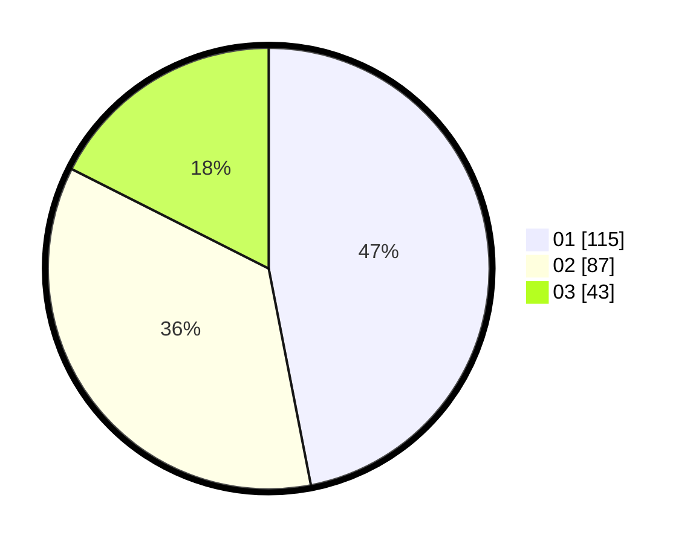

# Hasil

Hasil perolehan suara paslon dapat dilihat pada file paslon-01.txt, paslon-02.txt, dan paslon-03.txt.

Jika tidak ada, artinya data tersebut belum ada pada SIREKAP.

## Perolehan Suara

 * Paslon 01: **115**.
 * Paslon 02: **87**.
 * Paslon 03: **43**.

## Foto C Plano

https://sirekap-obj-formc.kpu.go.id/40af/pemilu/ppwp/31/73/02/10/05/3173021005054-20240215-005805--bb24f671-d1f3-4a9a-a176-662bbb771d23.jpg

https://sirekap-obj-formc.kpu.go.id/40af/pemilu/ppwp/31/73/02/10/05/3173021005054-20240215-010118--d7d9abf0-782d-4f32-a4af-6d9849716985.jpg

https://sirekap-obj-formc.kpu.go.id/40af/pemilu/ppwp/31/73/02/10/05/3173021005054-20240215-010622--5acfacaf-706f-4c46-828a-e94c72104e4f.jpg
