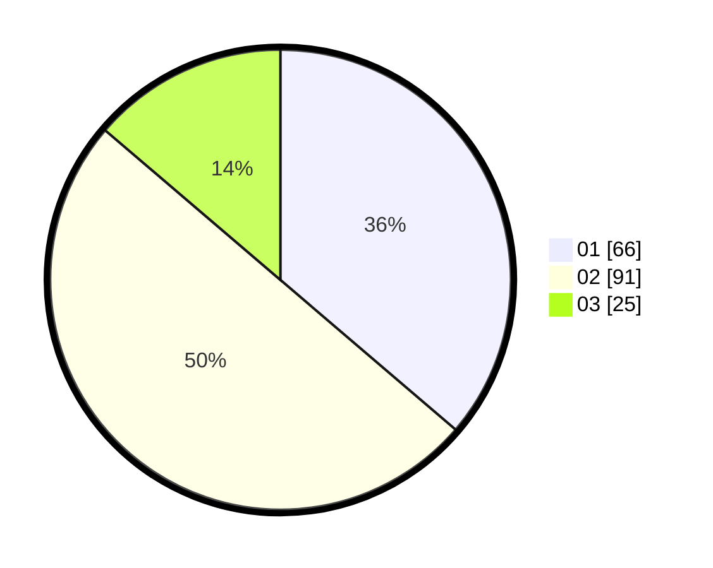

# Hasil

Hasil perolehan suara paslon dapat dilihat pada file paslon-01.txt, paslon-02.txt, dan paslon-03.txt.

Jika tidak ada, artinya data tersebut belum ada pada SIREKAP.

## Perolehan Suara

 * Paslon 01: **66**.
 * Paslon 02: **91**.
 * Paslon 03: **25**.

## Foto C Plano

https://sirekap-obj-formc.kpu.go.id/6e76/pemilu/ppwp/31/73/02/10/05/3173021005058-20240215-115522--8901a3ef-d587-4a99-bcc1-05077be7ffb5.jpg

https://sirekap-obj-formc.kpu.go.id/6e76/pemilu/ppwp/31/73/02/10/05/3173021005058-20240215-115543--1dffadcf-fba0-4842-ad04-e87ded595d68.jpg

https://sirekap-obj-formc.kpu.go.id/6e76/pemilu/ppwp/31/73/02/10/05/3173021005058-20240215-115533--f89d6184-24ac-4727-8ade-b013749c01e4.jpg

## DATA PEMILIH TETAP

Jumlah pemilih dalam DPT: **183**.
 * L: **83**.
 * P: **100**.

## DATA PENGGUNA HAK PILIH

Jumlah pengguna hak pilih dalam DPT: **165**.
 * L: **75**.
 * P: **90**.

Jumlah pengguna hak pilih dalam DPTb: **15**.
 * L: **7**.
 * P: **8**.

Jumlah pengguna hak pilih dalam DPK: **3**.
 * L: **1**.
 * P: **2**.

Jumlah pengguna hak pilih: **183**.
 * L: **83**.
 * P: **100**.

## JUMLAH SUARA SAH DAN TIDAK SAH

JUMLAH SELURUH SUARA SAH: **182**.

JUMLAH SUARA TIDAK SAH: **1**.

JUMLAH SELURUH SUARA SAH DAN SUARA TIDAK SAH: **183**.
