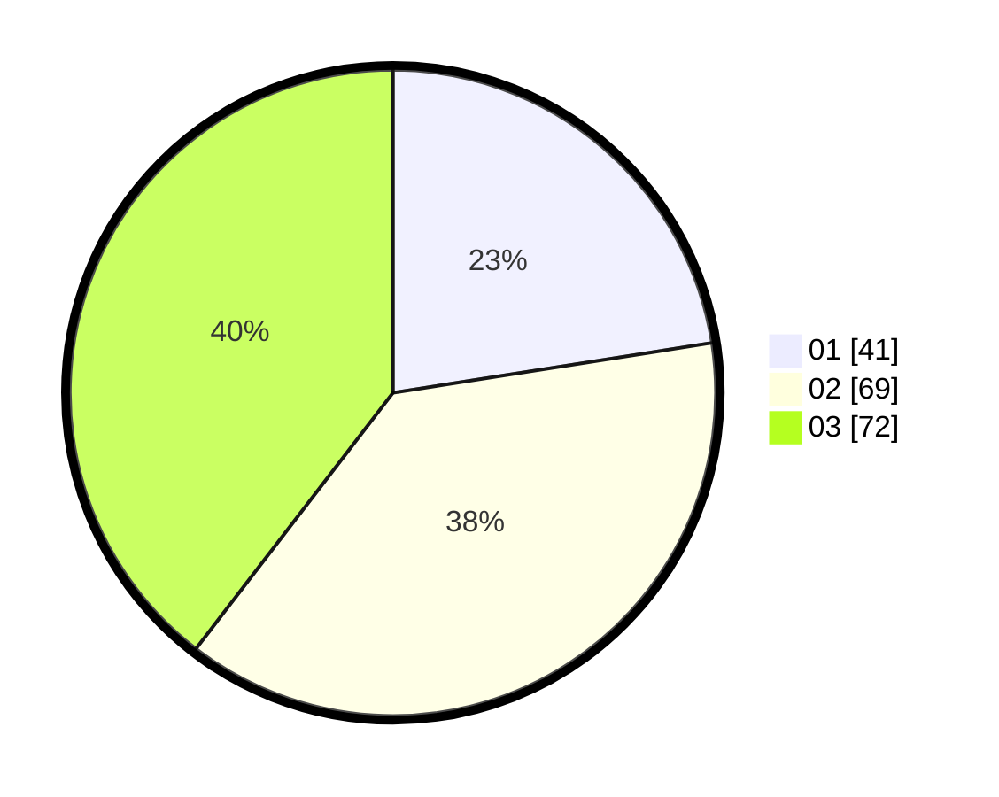

# Hasil

Hasil perolehan suara paslon dapat dilihat pada file paslon-01.txt, paslon-02.txt, dan paslon-03.txt.

Jika tidak ada, artinya data tersebut belum ada pada SIREKAP.

## Perolehan Suara

 * Paslon 01: **41**.
 * Paslon 02: **69**.
 * Paslon 03: **72**.

## Foto C Plano

https://sirekap-obj-formc.kpu.go.id/5fc3/pemilu/ppwp/31/73/02/10/05/3173021005059-20240216-005624--5ea490ac-b542-496c-954b-c0da5a19700b.jpg

https://sirekap-obj-formc.kpu.go.id/5fc3/pemilu/ppwp/31/73/02/10/05/3173021005059-20240216-010302--e8f8798d-ac4d-4415-868d-acb80757fae6.jpg

https://sirekap-obj-formc.kpu.go.id/5fc3/pemilu/ppwp/31/73/02/10/05/3173021005059-20240216-010600--a44af256-ec21-4115-bdb5-09b17f06cda7.jpg

## DATA PEMILIH TETAP

Jumlah pemilih dalam DPT: **229**.
 * L: **113**.
 * P: **116**.

## DATA PENGGUNA HAK PILIH

Jumlah pengguna hak pilih dalam DPT: **175**.
 * L: **90**.
 * P: **85**.

Jumlah pengguna hak pilih dalam DPTb: **10**.
 * L: **3**.
 * P: **7**.

Jumlah pengguna hak pilih dalam DPK: **0**.
 * L: **0**.
 * P: **0**.

Jumlah pengguna hak pilih: **185**.
 * L: **93**.
 * P: **92**.

## JUMLAH SUARA SAH DAN TIDAK SAH

JUMLAH SELURUH SUARA SAH: **182**.

JUMLAH SUARA TIDAK SAH: **3**.

JUMLAH SELURUH SUARA SAH DAN SUARA TIDAK SAH: **185**.
