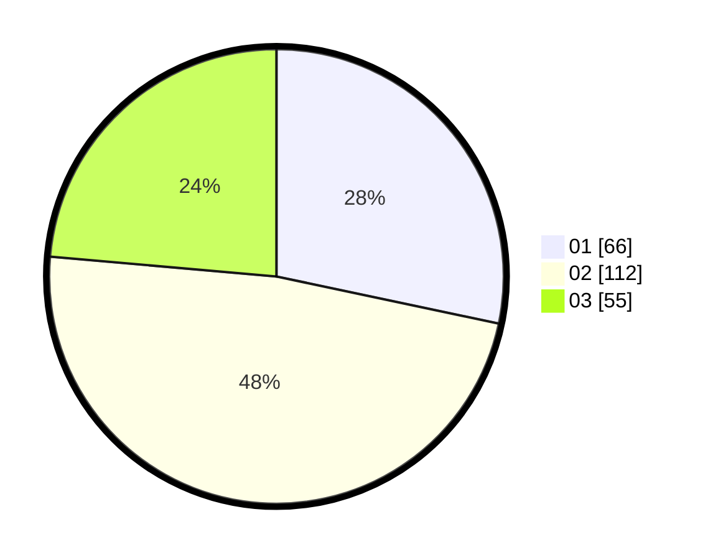

# Hasil

Hasil perolehan suara paslon dapat dilihat pada file paslon-01.txt, paslon-02.txt, dan paslon-03.txt.

Jika tidak ada, artinya data tersebut belum ada pada SIREKAP.

## Perolehan Suara

 * Paslon 01: **66**.
 * Paslon 02: **112**.
 * Paslon 03: **55**.

## Foto C Plano

https://sirekap-obj-formc.kpu.go.id/ee27/pemilu/ppwp/31/73/02/10/05/3173021005062-20240217-091916--98193cf5-d8ea-41e2-93aa-84691e3a323a.jpg

https://sirekap-obj-formc.kpu.go.id/ee27/pemilu/ppwp/31/73/02/10/05/3173021005062-20240217-094652--5ed21f78-f5ee-4550-b9ff-962fc8725bc6.jpg

https://sirekap-obj-formc.kpu.go.id/ee27/pemilu/ppwp/31/73/02/10/05/3173021005062-20240217-093723--44693006-2b1d-44ca-a76b-d0163abdab5d.jpg

## DATA PEMILIH TETAP

Jumlah pemilih dalam DPT: **293**.
 * L: **148**.
 * P: **145**.

## DATA PENGGUNA HAK PILIH

Jumlah pengguna hak pilih dalam DPT: **226**.
 * L: **115**.
 * P: **111**.

Jumlah pengguna hak pilih dalam DPTb: **8**.
 * L: **4**.
 * P: **4**.

Jumlah pengguna hak pilih dalam DPK: **2**.
 * L: **1**.
 * P: **1**.

Jumlah pengguna hak pilih: **236**.
 * L: **120**.
 * P: **116**.

## JUMLAH SUARA SAH DAN TIDAK SAH

JUMLAH SELURUH SUARA SAH: **233**.

JUMLAH SUARA TIDAK SAH: **3**.

JUMLAH SELURUH SUARA SAH DAN SUARA TIDAK SAH: **236**.
