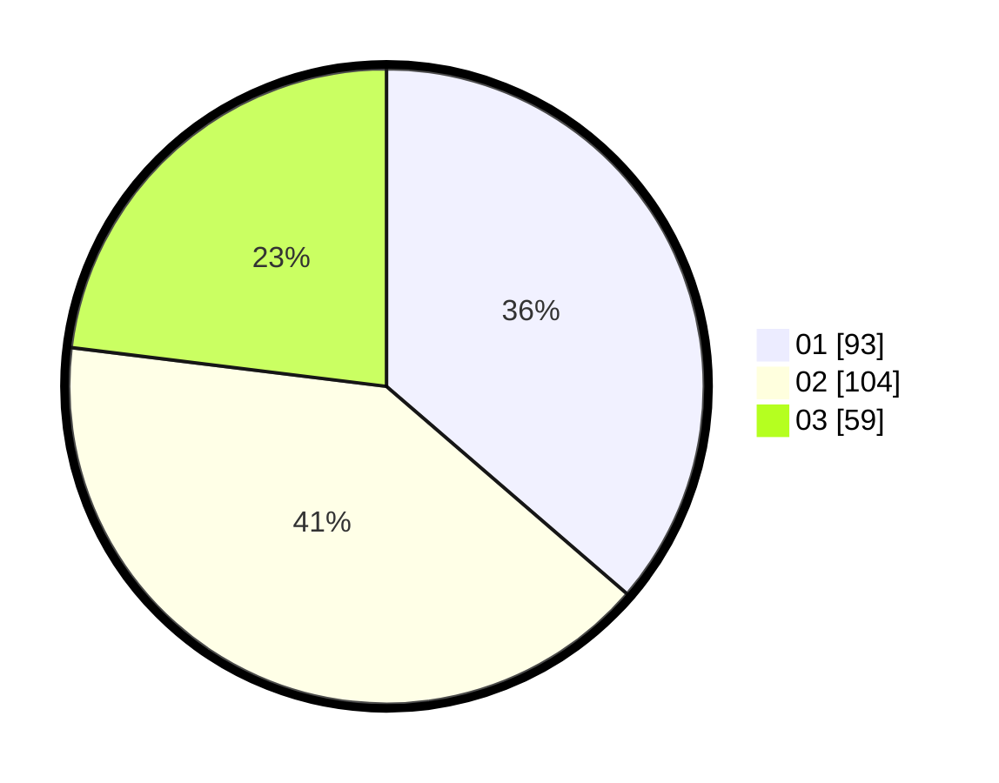

# Hasil

Hasil perolehan suara paslon dapat dilihat pada file paslon-01.txt, paslon-02.txt, dan paslon-03.txt.

Jika tidak ada, artinya data tersebut belum ada pada SIREKAP.

## Perolehan Suara

 * Paslon 01: **93**.
 * Paslon 02: **104**.
 * Paslon 03: **59**.

## Foto C Plano

https://sirekap-obj-formc.kpu.go.id/c5bb/pemilu/ppwp/31/73/02/10/05/3173021005069-20240214-230008--0506d9c5-0e23-4a77-a09c-bc3202618abc.jpg

https://sirekap-obj-formc.kpu.go.id/c5bb/pemilu/ppwp/31/73/02/10/05/3173021005069-20240214-230111--d32271a3-ed49-4c55-9d32-ad4d6330070e.jpg

https://sirekap-obj-formc.kpu.go.id/c5bb/pemilu/ppwp/31/73/02/10/05/3173021005069-20240214-204508--197c504a-deca-4481-899a-73ae81f344d0.jpg
