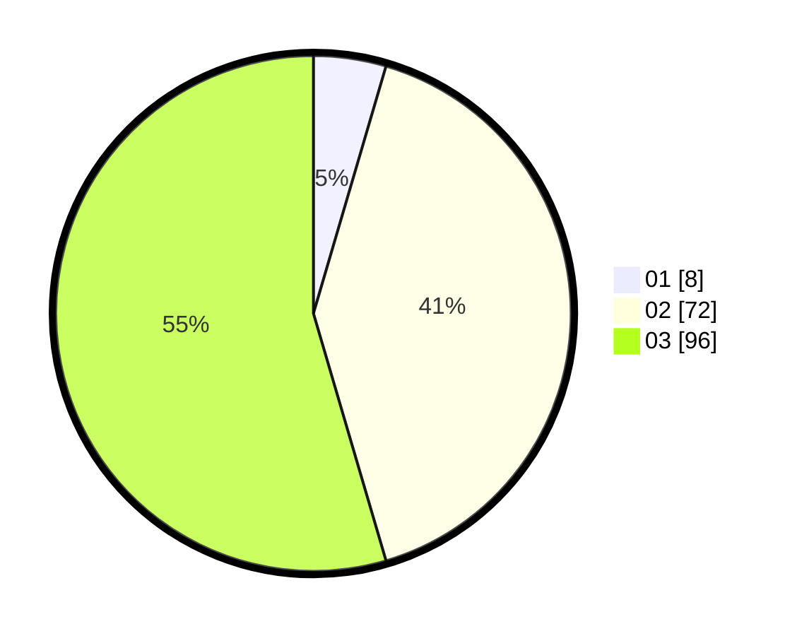

# Hasil

Hasil perolehan suara paslon dapat dilihat pada file paslon-01.txt, paslon-02.txt, dan paslon-03.txt.

Jika tidak ada, artinya data tersebut belum ada pada SIREKAP.

## Perolehan Suara

 * Paslon 01: **8**.
 * Paslon 02: **72**.
 * Paslon 03: **96**.

## Foto C Plano

https://sirekap-obj-formc.kpu.go.id/1674/pemilu/ppwp/31/73/02/10/05/3173021005072-20240214-141820--e9e40122-a322-461d-a545-2a0b55268e18.jpg

https://sirekap-obj-formc.kpu.go.id/1674/pemilu/ppwp/31/73/02/10/05/3173021005072-20240214-141908--a0820321-f57a-4615-93d1-24b4539591bd.jpg

https://sirekap-obj-formc.kpu.go.id/1674/pemilu/ppwp/31/73/02/10/05/3173021005072-20240214-141657--6079f549-8e67-4aeb-ba5c-6ab22dde8efa.jpg
