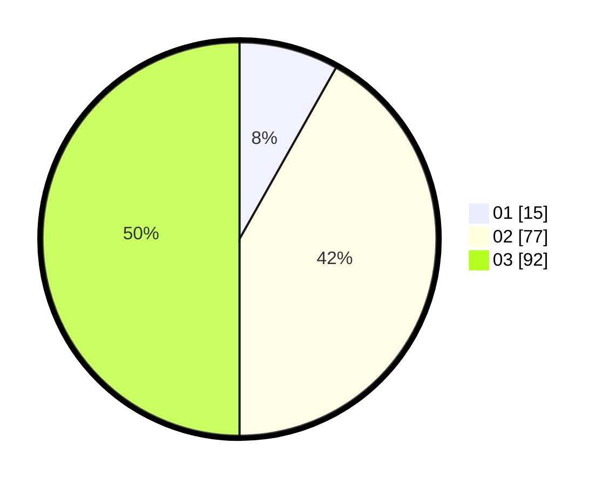

# Hasil

Hasil perolehan suara paslon dapat dilihat pada file paslon-01.txt, paslon-02.txt, dan paslon-03.txt.

Jika tidak ada, artinya data tersebut belum ada pada SIREKAP.

## Perolehan Suara

 * Paslon 01: **15**.
 * Paslon 02: **77**.
 * Paslon 03: **92**.

## Foto C Plano

https://sirekap-obj-formc.kpu.go.id/d9d8/pemilu/ppwp/31/73/02/10/05/3173021005074-20240214-202553--5ab1e031-9ec5-4665-874b-3c9970791815.jpg

https://sirekap-obj-formc.kpu.go.id/d9d8/pemilu/ppwp/31/73/02/10/05/3173021005074-20240214-202201--ea276f4d-2789-41d3-bdb8-359f39833847.jpg

https://sirekap-obj-formc.kpu.go.id/d9d8/pemilu/ppwp/31/73/02/10/05/3173021005074-20240214-202437--e7ee7d5a-c6cf-44d9-ab12-9bcf6ac8197f.jpg
