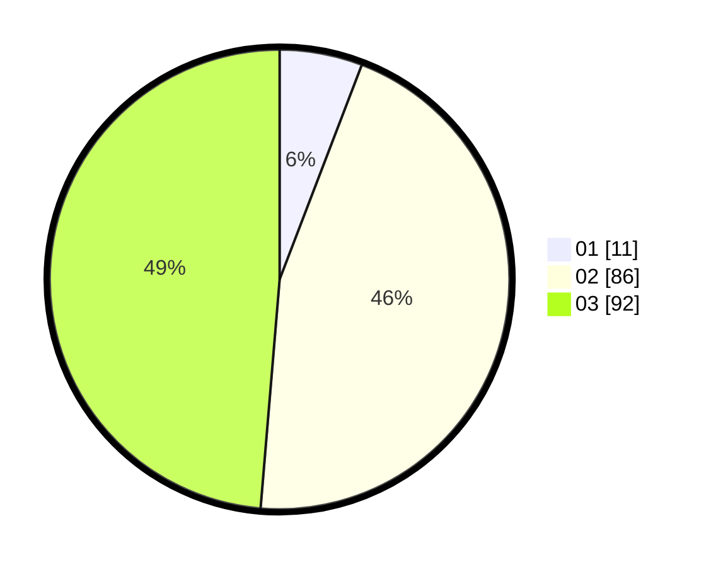

# Hasil

Hasil perolehan suara paslon dapat dilihat pada file paslon-01.txt, paslon-02.txt, dan paslon-03.txt.

Jika tidak ada, artinya data tersebut belum ada pada SIREKAP.

## Perolehan Suara

 * Paslon 01: **11**.
 * Paslon 02: **86**.
 * Paslon 03: **92**.

## Foto C Plano

https://sirekap-obj-formc.kpu.go.id/aea5/pemilu/ppwp/31/73/02/10/05/3173021005076-20240214-155311--11c35858-26e1-4b77-b49c-574fcde93be5.jpg

https://sirekap-obj-formc.kpu.go.id/aea5/pemilu/ppwp/31/73/02/10/05/3173021005076-20240214-155705--1f0b9dfc-a7d0-447f-866c-53b4cc54406a.jpg
