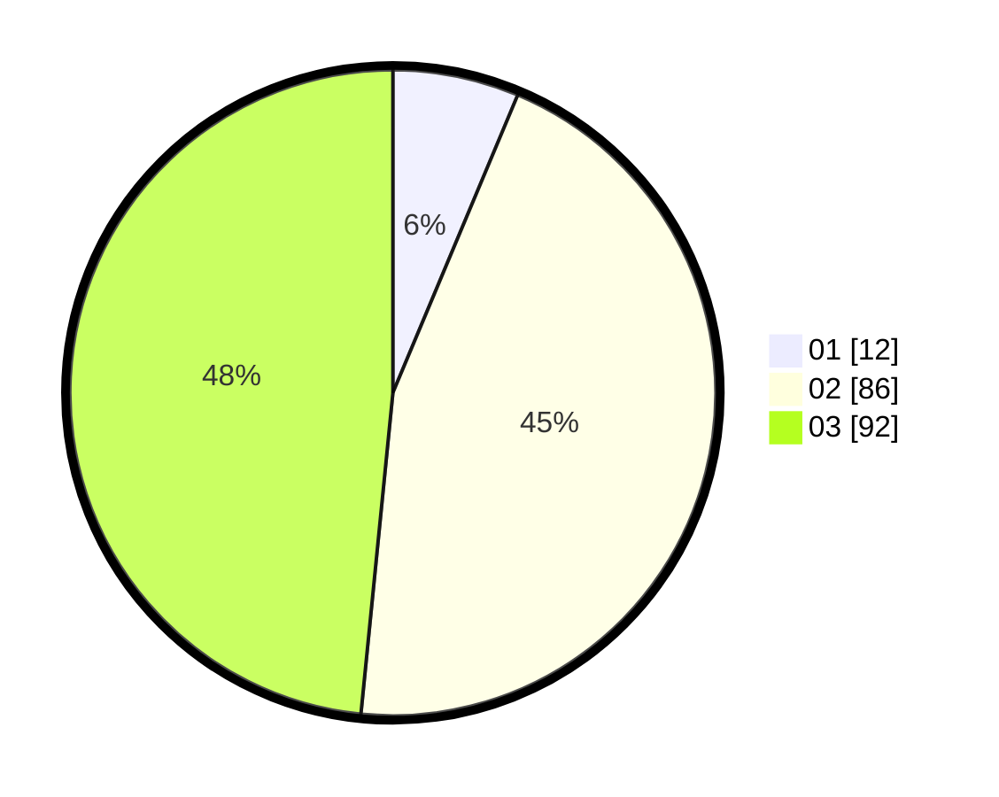

# Hasil

Hasil perolehan suara paslon dapat dilihat pada file paslon-01.txt, paslon-02.txt, dan paslon-03.txt.

Jika tidak ada, artinya data tersebut belum ada pada SIREKAP.

## Perolehan Suara

 * Paslon 01: **12**.
 * Paslon 02: **86**.
 * Paslon 03: **92**.

## Foto C Plano

https://sirekap-obj-formc.kpu.go.id/87a1/pemilu/ppwp/31/73/02/10/05/3173021005083-20240217-001050--5f9bc944-10b8-4b2f-99f9-80185688376d.jpg

https://sirekap-obj-formc.kpu.go.id/87a1/pemilu/ppwp/31/73/02/10/05/3173021005083-20240217-001531--fd7b7028-25be-4bfa-87b7-d85a769e7e8e.jpg

https://sirekap-obj-formc.kpu.go.id/87a1/pemilu/ppwp/31/73/02/10/05/3173021005083-20240217-001343--158e2a89-08d3-42d1-b5c5-92ddb1c42695.jpg
