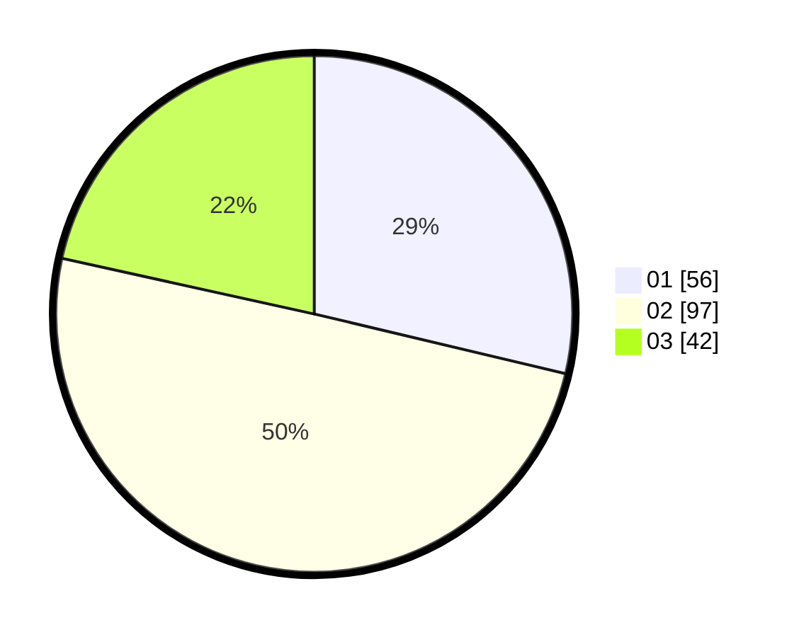

# Hasil

Hasil perolehan suara paslon dapat dilihat pada file paslon-01.txt, paslon-02.txt, dan paslon-03.txt.

Jika tidak ada, artinya data tersebut belum ada pada SIREKAP.

## Perolehan Suara

 * Paslon 01: **56**.
 * Paslon 02: **97**.
 * Paslon 03: **42**.

## Foto C Plano

https://sirekap-obj-formc.kpu.go.id/de37/pemilu/ppwp/31/73/02/10/06/3173021006002-20240214-192039--4097042f-4870-4dda-994a-2fe5ba36d393.jpg

https://sirekap-obj-formc.kpu.go.id/de37/pemilu/ppwp/31/73/02/10/06/3173021006002-20240214-234507--826a4ce4-197c-4f6a-a170-200e1c9f9bb9.jpg

https://sirekap-obj-formc.kpu.go.id/de37/pemilu/ppwp/31/73/02/10/06/3173021006002-20240214-234809--6edc01eb-9610-4ed4-bb2e-44e798e5e820.jpg

## DATA PEMILIH TETAP

Jumlah pemilih dalam DPT: **256**.
 * L: **124**.
 * P: **132**.

## DATA PENGGUNA HAK PILIH

Jumlah pengguna hak pilih dalam DPT: **256**.
 * L: **124**.
 * P: **132**.

Jumlah pengguna hak pilih dalam DPTb: **11**.
 * L: **2**.
 * P: **9**.

Jumlah pengguna hak pilih dalam DPK: **4**.
 * L: **3**.
 * P: **1**.

Jumlah pengguna hak pilih: **271**.
 * L: **129**.
 * P: **142**.

## JUMLAH SUARA SAH DAN TIDAK SAH

JUMLAH SELURUH SUARA SAH: **195**.

JUMLAH SUARA TIDAK SAH: **0**.

JUMLAH SELURUH SUARA SAH DAN SUARA TIDAK SAH: **195**.
