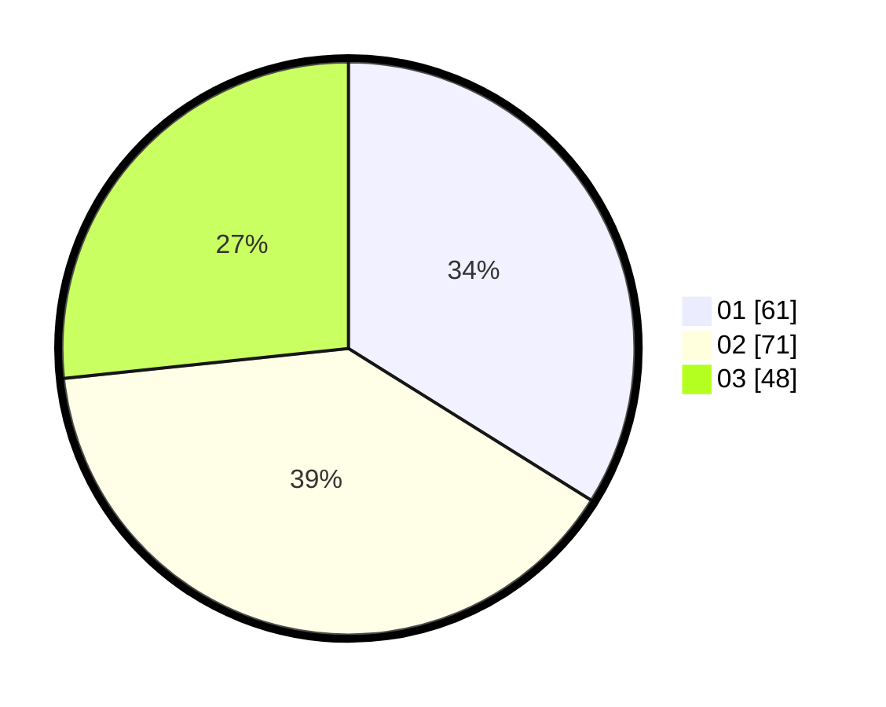

# Hasil

Hasil perolehan suara paslon dapat dilihat pada file paslon-01.txt, paslon-02.txt, dan paslon-03.txt.

Jika tidak ada, artinya data tersebut belum ada pada SIREKAP.

## Perolehan Suara

 * Paslon 01: **61**.
 * Paslon 02: **71**.
 * Paslon 03: **48**.

## Foto C Plano

https://sirekap-obj-formc.kpu.go.id/827f/pemilu/ppwp/31/73/02/10/06/3173021006007-20240216-064639--daa4c3a2-b3fd-427a-bd27-b11399f09bf7.jpg

https://sirekap-obj-formc.kpu.go.id/827f/pemilu/ppwp/31/73/02/10/06/3173021006007-20240217-213500--4f95c6b0-aa61-4a03-9046-a87875cc625d.jpg

https://sirekap-obj-formc.kpu.go.id/827f/pemilu/ppwp/31/73/02/10/06/3173021006007-20240214-155548--04307e36-0350-4208-832b-2bc84b7af0f8.jpg
