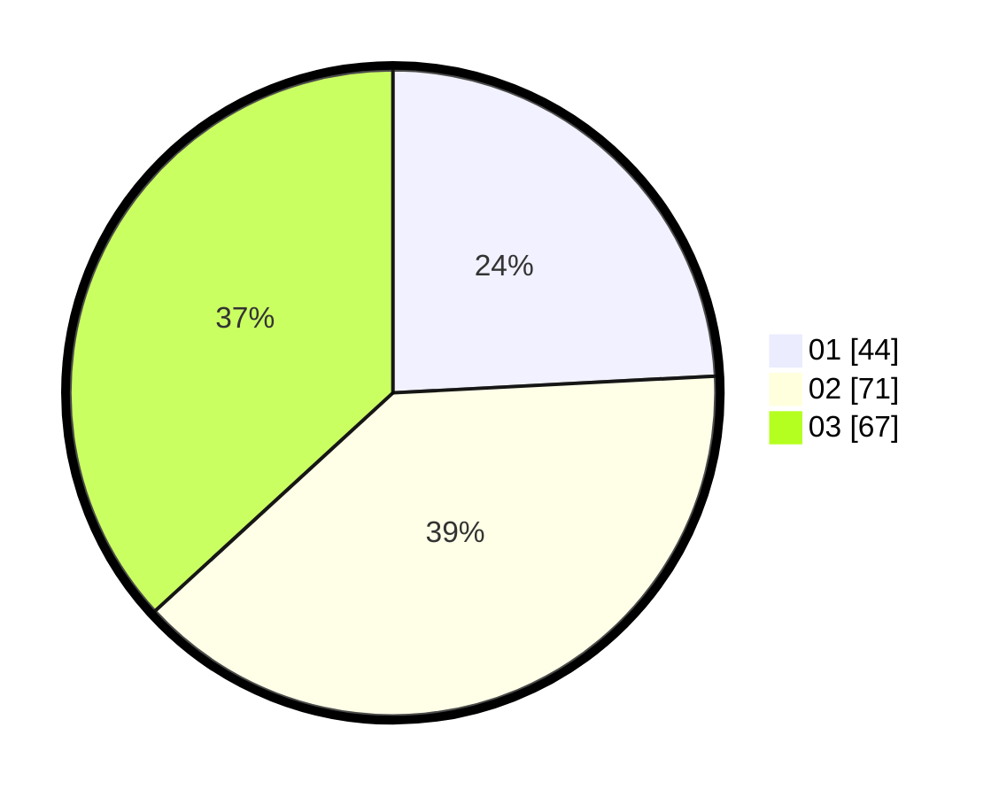

# Hasil

Hasil perolehan suara paslon dapat dilihat pada file paslon-01.txt, paslon-02.txt, dan paslon-03.txt.

Jika tidak ada, artinya data tersebut belum ada pada SIREKAP.

## Perolehan Suara

 * Paslon 01: **44**.
 * Paslon 02: **71**.
 * Paslon 03: **67**.

## Foto C Plano

https://sirekap-obj-formc.kpu.go.id/d0ce/pemilu/ppwp/31/73/02/10/06/3173021006010-20240214-221835--af1dc5fa-311b-49cf-b0a8-c205db36ef79.jpg

https://sirekap-obj-formc.kpu.go.id/d0ce/pemilu/ppwp/31/73/02/10/06/3173021006010-20240214-222029--9a68d555-775b-4ca7-b86e-67ecd8d480d7.jpg

https://sirekap-obj-formc.kpu.go.id/d0ce/pemilu/ppwp/31/73/02/10/06/3173021006010-20240214-222254--3e9e79eb-d3e2-4df6-a586-5c460c29e6e0.jpg
