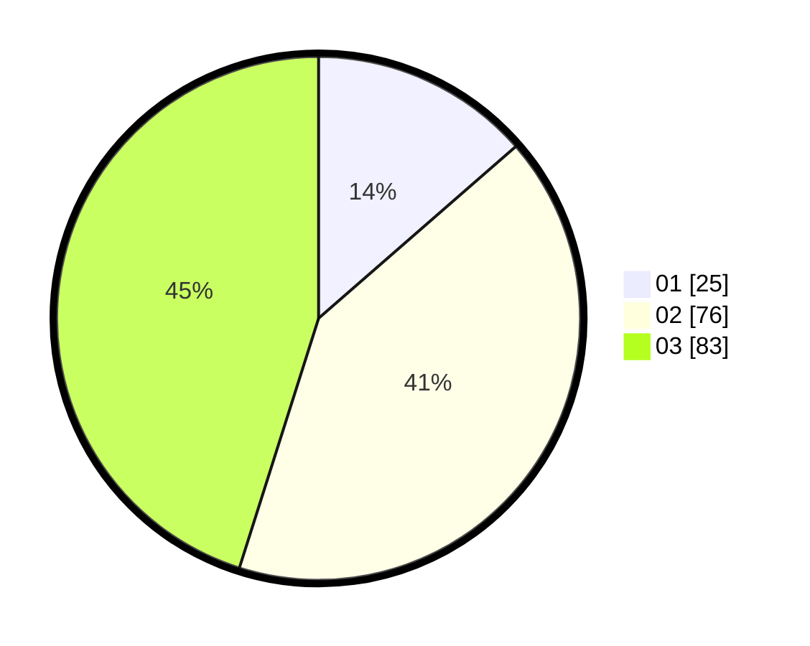

# Hasil

Hasil perolehan suara paslon dapat dilihat pada file paslon-01.txt, paslon-02.txt, dan paslon-03.txt.

Jika tidak ada, artinya data tersebut belum ada pada SIREKAP.

## Perolehan Suara

 * Paslon 01: **25**.
 * Paslon 02: **76**.
 * Paslon 03: **83**.

## Foto C Plano

https://sirekap-obj-formc.kpu.go.id/1cde/pemilu/ppwp/31/73/02/10/06/3173021006013-20240214-203545--c5676b94-13d6-4aa4-921b-eb3b24e17fae.jpg

https://sirekap-obj-formc.kpu.go.id/1cde/pemilu/ppwp/31/73/02/10/06/3173021006013-20240214-215344--99742229-c7c8-4fe2-b5cc-a6459565aa4a.jpg

https://sirekap-obj-formc.kpu.go.id/1cde/pemilu/ppwp/31/73/02/10/06/3173021006013-20240214-220438--631228d5-b65f-4137-a5c3-d69720c7f092.jpg

## DATA PEMILIH TETAP

Jumlah pemilih dalam DPT: **287**.
 * L: **147**.
 * P: **140**.

## DATA PENGGUNA HAK PILIH

Jumlah pengguna hak pilih dalam DPT: **183**.
 * L: **87**.
 * P: **96**.

Jumlah pengguna hak pilih dalam DPTb: **0**.
 * L: **0**.
 * P: **0**.

Jumlah pengguna hak pilih dalam DPK: **4**.
 * L: **2**.
 * P: **2**.

Jumlah pengguna hak pilih: **187**.
 * L: **89**.
 * P: **98**.

## JUMLAH SUARA SAH DAN TIDAK SAH

JUMLAH SELURUH SUARA SAH: **184**.

JUMLAH SUARA TIDAK SAH: **3**.

JUMLAH SELURUH SUARA SAH DAN SUARA TIDAK SAH: **187**.
