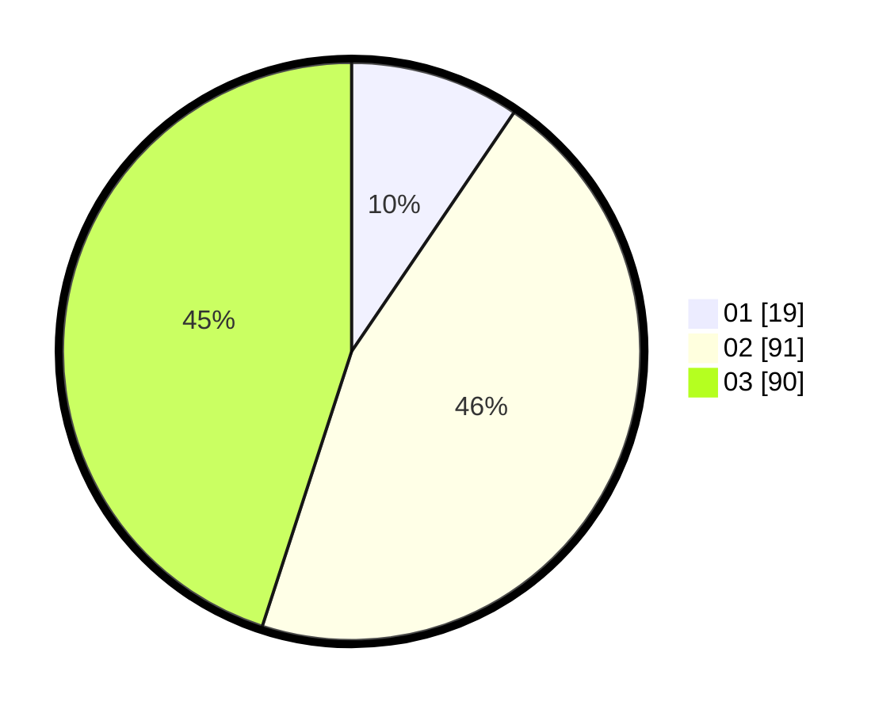

# Hasil

Hasil perolehan suara paslon dapat dilihat pada file paslon-01.txt, paslon-02.txt, dan paslon-03.txt.

Jika tidak ada, artinya data tersebut belum ada pada SIREKAP.

## Perolehan Suara

 * Paslon 01: **19**.
 * Paslon 02: **91**.
 * Paslon 03: **90**.

## Foto C Plano

https://sirekap-obj-formc.kpu.go.id/500e/pemilu/ppwp/31/73/02/10/06/3173021006026-20240214-160106--1ba5b87d-7c9d-4fbd-af9a-0a4ca1deb44f.jpg

https://sirekap-obj-formc.kpu.go.id/500e/pemilu/ppwp/31/73/02/10/06/3173021006026-20240215-215647--7ab24ebe-4388-43f2-baa8-ad77eb272bd9.jpg

https://sirekap-obj-formc.kpu.go.id/500e/pemilu/ppwp/31/73/02/10/06/3173021006026-20240214-192556--0720b320-eee1-495b-9b64-9f591d98f9b6.jpg

## DATA PEMILIH TETAP

Jumlah pemilih dalam DPT: **289**.
 * L: **144**.
 * P: **145**.

## DATA PENGGUNA HAK PILIH

Jumlah pengguna hak pilih dalam DPT: **187**.
 * L: **95**.
 * P: **92**.

Jumlah pengguna hak pilih dalam DPTb: **16**.
 * L: **9**.
 * P: **7**.

Jumlah pengguna hak pilih dalam DPK: **0**.
 * L: **0**.
 * P: **0**.

Jumlah pengguna hak pilih: **203**.
 * L: **104**.
 * P: **99**.

## JUMLAH SUARA SAH DAN TIDAK SAH

JUMLAH SELURUH SUARA SAH: **200**.

JUMLAH SUARA TIDAK SAH: **3**.

JUMLAH SELURUH SUARA SAH DAN SUARA TIDAK SAH: **203**.
