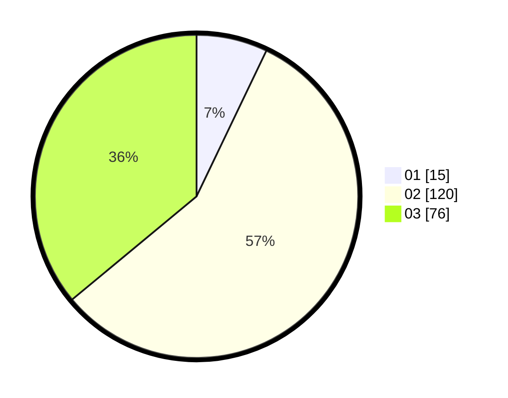

# Hasil

Hasil perolehan suara paslon dapat dilihat pada file paslon-01.txt, paslon-02.txt, dan paslon-03.txt.

Jika tidak ada, artinya data tersebut belum ada pada SIREKAP.

## Perolehan Suara

 * Paslon 01: **15**.
 * Paslon 02: **120**.
 * Paslon 03: **76**.

## Foto C Plano

https://sirekap-obj-formc.kpu.go.id/824a/pemilu/ppwp/31/73/02/10/06/3173021006027-20240214-200641--1673ba3f-7d38-4cfe-ba37-2ca1c253226a.jpg

https://sirekap-obj-formc.kpu.go.id/824a/pemilu/ppwp/31/73/02/10/06/3173021006027-20240214-201231--71a87094-8973-49f7-8b3a-25c27343983f.jpg

https://sirekap-obj-formc.kpu.go.id/824a/pemilu/ppwp/31/73/02/10/06/3173021006027-20240214-200901--fe85480c-c845-4738-8dfe-507eb397a3bc.jpg

## DATA PEMILIH TETAP

Jumlah pemilih dalam DPT: **287**.
 * L: **137**.
 * P: **150**.

## DATA PENGGUNA HAK PILIH

Jumlah pengguna hak pilih dalam DPT: **206**.
 * L: **96**.
 * P: **110**.

Jumlah pengguna hak pilih dalam DPTb: **4**.
 * L: **3**.
 * P: **1**.

Jumlah pengguna hak pilih dalam DPK: **1**.
 * L: **1**.
 * P: **0**.

Jumlah pengguna hak pilih: **211**.
 * L: **100**.
 * P: **111**.

## JUMLAH SUARA SAH DAN TIDAK SAH

JUMLAH SELURUH SUARA SAH: **211**.

JUMLAH SUARA TIDAK SAH: **0**.

JUMLAH SELURUH SUARA SAH DAN SUARA TIDAK SAH: **211**.
