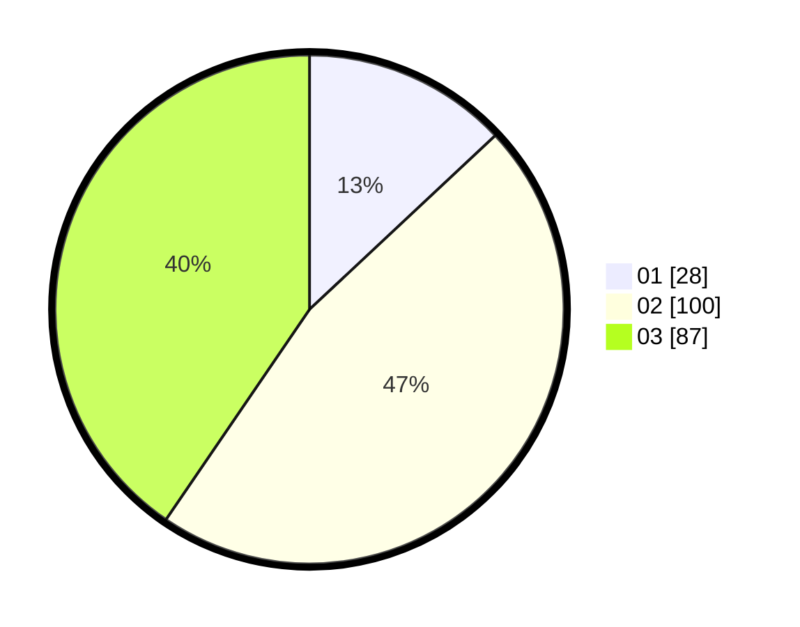

# Hasil

Hasil perolehan suara paslon dapat dilihat pada file paslon-01.txt, paslon-02.txt, dan paslon-03.txt.

Jika tidak ada, artinya data tersebut belum ada pada SIREKAP.

## Perolehan Suara

 * Paslon 01: **28**.
 * Paslon 02: **100**.
 * Paslon 03: **87**.

## Foto C Plano

https://sirekap-obj-formc.kpu.go.id/4232/pemilu/ppwp/31/73/02/10/06/3173021006032-20240214-190257--7102e1ba-6e49-4d74-94a8-4f916c7a3f4d.jpg

https://sirekap-obj-formc.kpu.go.id/4232/pemilu/ppwp/31/73/02/10/06/3173021006032-20240214-190248--c0ffefda-5e0f-4460-8388-d0b350db558d.jpg

https://sirekap-obj-formc.kpu.go.id/4232/pemilu/ppwp/31/73/02/10/06/3173021006032-20240214-175328--ac0e4fe5-8c30-4e4e-b440-1d8944f6c103.jpg

## DATA PEMILIH TETAP

Jumlah pemilih dalam DPT: **297**.
 * L: **134**.
 * P: **163**.

## DATA PENGGUNA HAK PILIH

Jumlah pengguna hak pilih dalam DPT: **218**.
 * L: **101**.
 * P: **117**.

Jumlah pengguna hak pilih dalam DPTb: **1**.
 * L: **0**.
 * P: **1**.

Jumlah pengguna hak pilih dalam DPK: **3**.
 * L: **1**.
 * P: **2**.

Jumlah pengguna hak pilih: **222**.
 * L: **102**.
 * P: **120**.

## JUMLAH SUARA SAH DAN TIDAK SAH

JUMLAH SELURUH SUARA SAH: **215**.

JUMLAH SUARA TIDAK SAH: **7**.

JUMLAH SELURUH SUARA SAH DAN SUARA TIDAK SAH: **222**.
