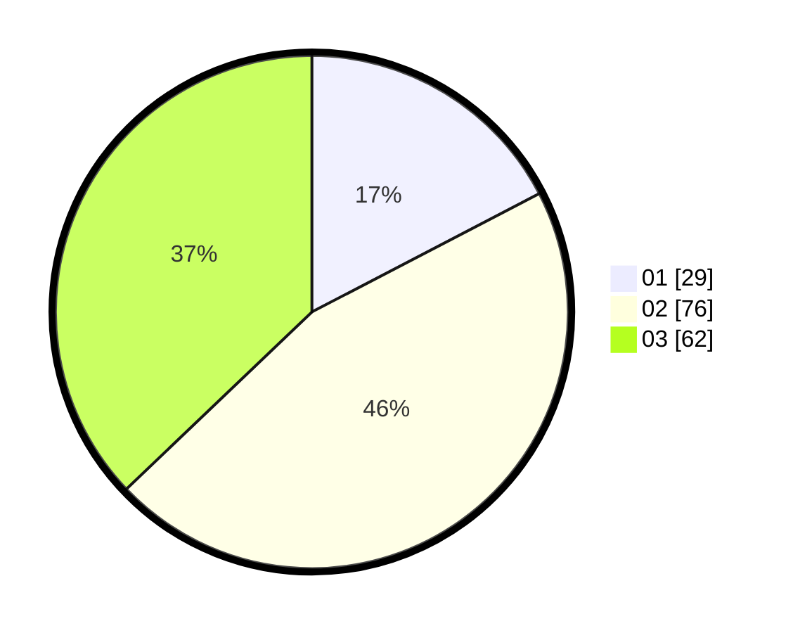

# Hasil

Hasil perolehan suara paslon dapat dilihat pada file paslon-01.txt, paslon-02.txt, dan paslon-03.txt.

Jika tidak ada, artinya data tersebut belum ada pada SIREKAP.

## Perolehan Suara

 * Paslon 01: **29**.
 * Paslon 02: **76**.
 * Paslon 03: **62**.

## Foto C Plano

https://sirekap-obj-formc.kpu.go.id/d365/pemilu/ppwp/31/73/02/10/06/3173021006035-20240214-210330--0d00dcf0-086a-400c-830f-5972e117616e.jpg

https://sirekap-obj-formc.kpu.go.id/d365/pemilu/ppwp/31/73/02/10/06/3173021006035-20240214-210530--208c3a77-67ef-4683-8ba5-c3963ec50f86.jpg

https://sirekap-obj-formc.kpu.go.id/d365/pemilu/ppwp/31/73/02/10/06/3173021006035-20240214-210629--0cad6239-d9bb-4755-bb9f-05a5ec40d4b3.jpg

## DATA PEMILIH TETAP

Jumlah pemilih dalam DPT: **256**.
 * L: **133**.
 * P: **123**.

## DATA PENGGUNA HAK PILIH

Jumlah pengguna hak pilih dalam DPT: **164**.
 * L: **83**.
 * P: **81**.

Jumlah pengguna hak pilih dalam DPTb: **4**.
 * L: **1**.
 * P: **3**.

Jumlah pengguna hak pilih dalam DPK: **1**.
 * L: **1**.
 * P: **0**.

Jumlah pengguna hak pilih: **169**.
 * L: **85**.
 * P: **84**.

## JUMLAH SUARA SAH DAN TIDAK SAH

JUMLAH SELURUH SUARA SAH: **167**.

JUMLAH SUARA TIDAK SAH: **2**.

JUMLAH SELURUH SUARA SAH DAN SUARA TIDAK SAH: **169**.
