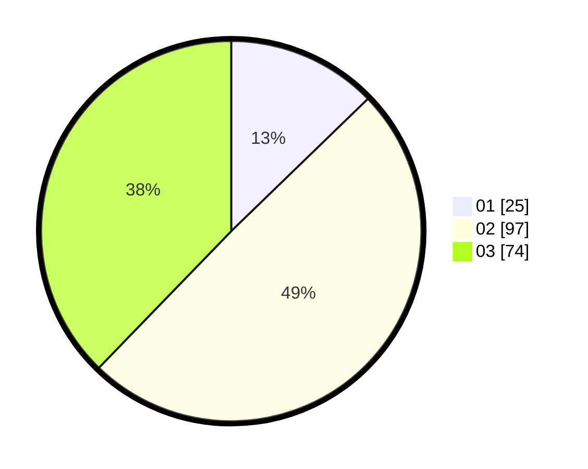

# Hasil

Hasil perolehan suara paslon dapat dilihat pada file paslon-01.txt, paslon-02.txt, dan paslon-03.txt.

Jika tidak ada, artinya data tersebut belum ada pada SIREKAP.

## Perolehan Suara

 * Paslon 01: **25**.
 * Paslon 02: **97**.
 * Paslon 03: **74**.

## Foto C Plano

https://sirekap-obj-formc.kpu.go.id/64ea/pemilu/ppwp/31/73/02/10/06/3173021006037-20240215-001748--76b45cd3-012b-4b5d-92d7-e1fe9132a7a6.jpg

https://sirekap-obj-formc.kpu.go.id/64ea/pemilu/ppwp/31/73/02/10/06/3173021006037-20240215-005149--fdeb9beb-7ddf-4d0d-8e22-f97743b44159.jpg

https://sirekap-obj-formc.kpu.go.id/64ea/pemilu/ppwp/31/73/02/10/06/3173021006037-20240215-005718--1f7d217f-c7aa-47d1-89c8-6a7f5ffa54ba.jpg
