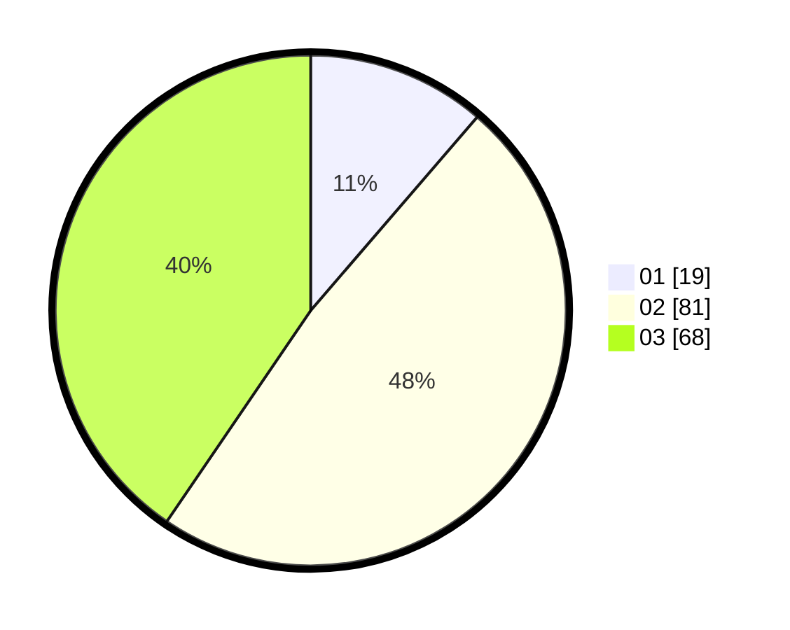

# Hasil

Hasil perolehan suara paslon dapat dilihat pada file paslon-01.txt, paslon-02.txt, dan paslon-03.txt.

Jika tidak ada, artinya data tersebut belum ada pada SIREKAP.

## Perolehan Suara

 * Paslon 01: **19**.
 * Paslon 02: **81**.
 * Paslon 03: **68**.

## Foto C Plano

https://sirekap-obj-formc.kpu.go.id/43af/pemilu/ppwp/31/73/02/10/06/3173021006038-20240214-232124--7d7afb02-f8b0-42d1-b5b5-9c0d9f1273c0.jpg

https://sirekap-obj-formc.kpu.go.id/43af/pemilu/ppwp/31/73/02/10/06/3173021006038-20240214-232322--f17e32b9-3f1d-4e7e-842a-9bed6b21bbc2.jpg

https://sirekap-obj-formc.kpu.go.id/43af/pemilu/ppwp/31/73/02/10/06/3173021006038-20240214-232438--e7dde9ac-cd32-4a6e-bfce-b5922d5ac46d.jpg
