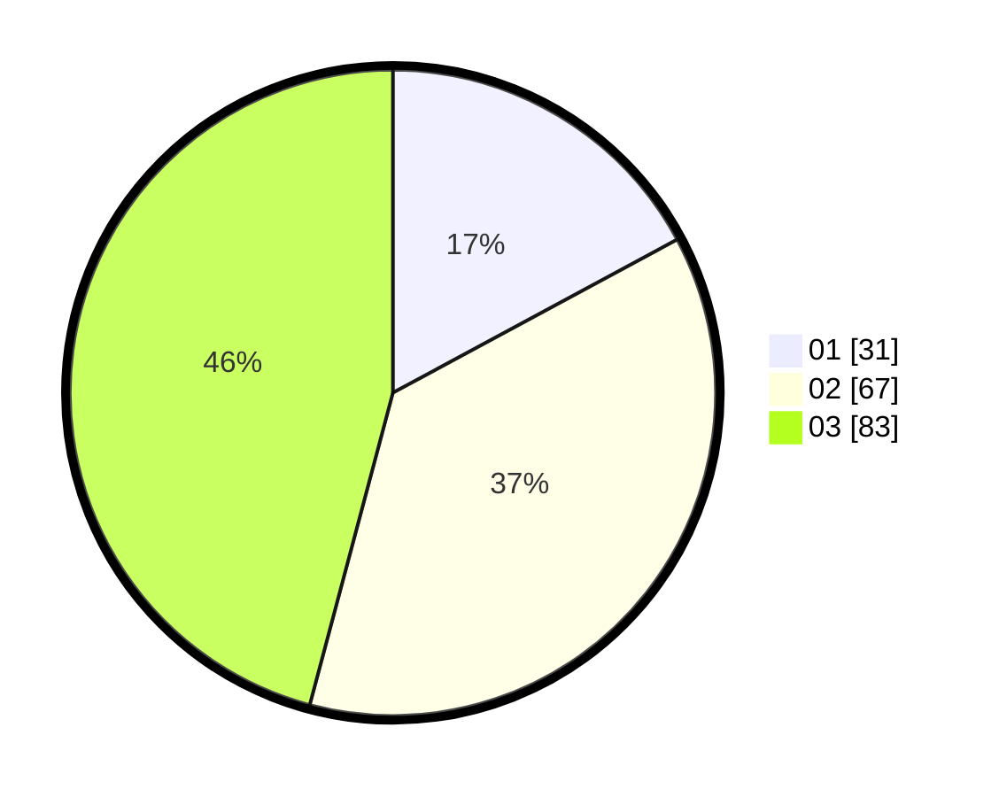

# Hasil

Hasil perolehan suara paslon dapat dilihat pada file paslon-01.txt, paslon-02.txt, dan paslon-03.txt.

Jika tidak ada, artinya data tersebut belum ada pada SIREKAP.

## Perolehan Suara

 * Paslon 01: **31**.
 * Paslon 02: **67**.
 * Paslon 03: **83**.

## Foto C Plano

https://sirekap-obj-formc.kpu.go.id/9405/pemilu/ppwp/31/73/02/10/06/3173021006045-20240215-100424--eacfe06f-2d33-4fcb-b57f-e26bc58430a6.jpg

https://sirekap-obj-formc.kpu.go.id/9405/pemilu/ppwp/31/73/02/10/06/3173021006045-20240215-110110--9407cbd1-51e7-44d0-a982-3d194dac587b.jpg
