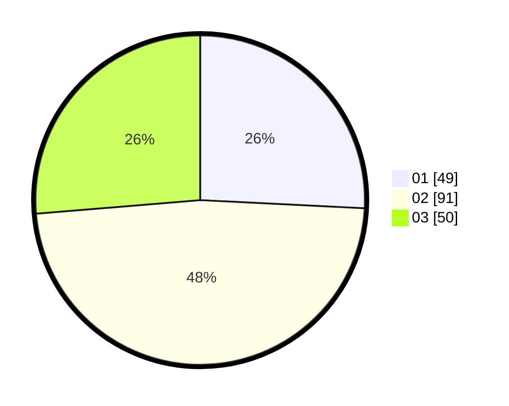

# Hasil

Hasil perolehan suara paslon dapat dilihat pada file paslon-01.txt, paslon-02.txt, dan paslon-03.txt.

Jika tidak ada, artinya data tersebut belum ada pada SIREKAP.

## Perolehan Suara

 * Paslon 01: **49**.
 * Paslon 02: **91**.
 * Paslon 03: **50**.

## Foto C Plano

https://sirekap-obj-formc.kpu.go.id/dd69/pemilu/ppwp/31/73/02/10/06/3173021006047-20240214-231843--bf5faed5-15fd-4df6-9c83-41ee26358942.jpg

https://sirekap-obj-formc.kpu.go.id/dd69/pemilu/ppwp/31/73/02/10/06/3173021006047-20240215-124927--56bdf09c-e410-49a1-be53-15e9247a9a2e.jpg

https://sirekap-obj-formc.kpu.go.id/dd69/pemilu/ppwp/31/73/02/10/06/3173021006047-20240215-184130--43242e29-6f0e-41c5-b9d6-2a5ada1bee92.jpg
