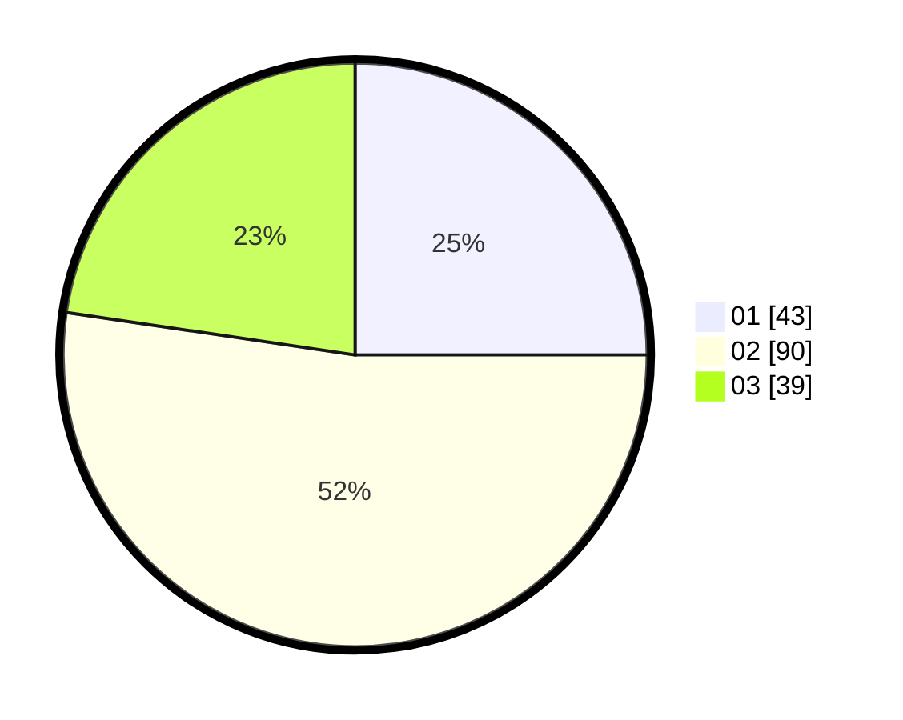

# Hasil

Hasil perolehan suara paslon dapat dilihat pada file paslon-01.txt, paslon-02.txt, dan paslon-03.txt.

Jika tidak ada, artinya data tersebut belum ada pada SIREKAP.

## Perolehan Suara

 * Paslon 01: **43**.
 * Paslon 02: **90**.
 * Paslon 03: **39**.

## Foto C Plano

https://sirekap-obj-formc.kpu.go.id/4153/pemilu/ppwp/31/73/02/10/06/3173021006050-20240215-001501--15245820-d82c-48ac-9b5b-77475f18da89.jpg

https://sirekap-obj-formc.kpu.go.id/4153/pemilu/ppwp/31/73/02/10/06/3173021006050-20240215-001605--05a88b08-dab7-4275-a2a2-6acd8a018976.jpg

https://sirekap-obj-formc.kpu.go.id/4153/pemilu/ppwp/31/73/02/10/06/3173021006050-20240215-001509--809352e6-ae8d-45a9-8276-6721140c8dc4.jpg

## DATA PEMILIH TETAP

Jumlah pemilih dalam DPT: **249**.
 * L: **118**.
 * P: **131**.

## DATA PENGGUNA HAK PILIH

Jumlah pengguna hak pilih dalam DPT: **174**.
 * L: **82**.
 * P: **92**.

Jumlah pengguna hak pilih dalam DPTb: **0**.
 * L: **0**.
 * P: **0**.

Jumlah pengguna hak pilih dalam DPK: **0**.
 * L: **0**.
 * P: **0**.

Jumlah pengguna hak pilih: **174**.
 * L: **82**.
 * P: **92**.

## JUMLAH SUARA SAH DAN TIDAK SAH

JUMLAH SELURUH SUARA SAH: **172**.

JUMLAH SUARA TIDAK SAH: **2**.

JUMLAH SELURUH SUARA SAH DAN SUARA TIDAK SAH: **174**.
