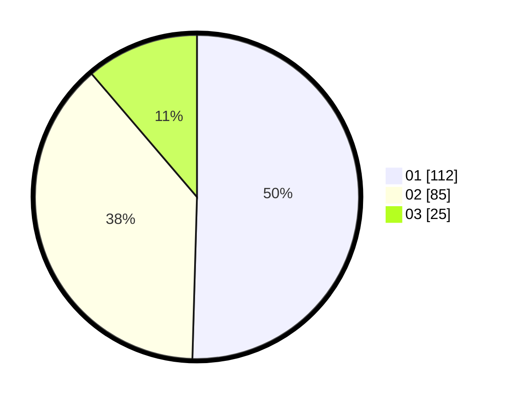

# Hasil

Hasil perolehan suara paslon dapat dilihat pada file paslon-01.txt, paslon-02.txt, dan paslon-03.txt.

Jika tidak ada, artinya data tersebut belum ada pada SIREKAP.

## Perolehan Suara

 * Paslon 01: **112**.
 * Paslon 02: **85**.
 * Paslon 03: **25**.

## Foto C Plano

https://sirekap-obj-formc.kpu.go.id/6392/pemilu/ppwp/31/73/02/10/06/3173021006051-20240216-204800--02a08430-5b5d-4898-9afa-0369c0a6becc.jpg

https://sirekap-obj-formc.kpu.go.id/6392/pemilu/ppwp/31/73/02/10/06/3173021006051-20240216-211933--198910db-cef2-4cc0-9fdf-36f1160c9a92.jpg

https://sirekap-obj-formc.kpu.go.id/6392/pemilu/ppwp/31/73/02/10/06/3173021006051-20240216-211151--e916c902-de17-4ac4-b665-94d248c30bd9.jpg

## DATA PEMILIH TETAP

Jumlah pemilih dalam DPT: **273**.
 * L: **137**.
 * P: **136**.

## DATA PENGGUNA HAK PILIH

Jumlah pengguna hak pilih dalam DPT: **223**.
 * L: **108**.
 * P: **115**.

Jumlah pengguna hak pilih dalam DPTb: **0**.
 * L: **0**.
 * P: **0**.

Jumlah pengguna hak pilih dalam DPK: **1**.
 * L: **1**.
 * P: **0**.

Jumlah pengguna hak pilih: **224**.
 * L: **109**.
 * P: **115**.

## JUMLAH SUARA SAH DAN TIDAK SAH

JUMLAH SELURUH SUARA SAH: **222**.

JUMLAH SUARA TIDAK SAH: **2**.

JUMLAH SELURUH SUARA SAH DAN SUARA TIDAK SAH: **224**.
