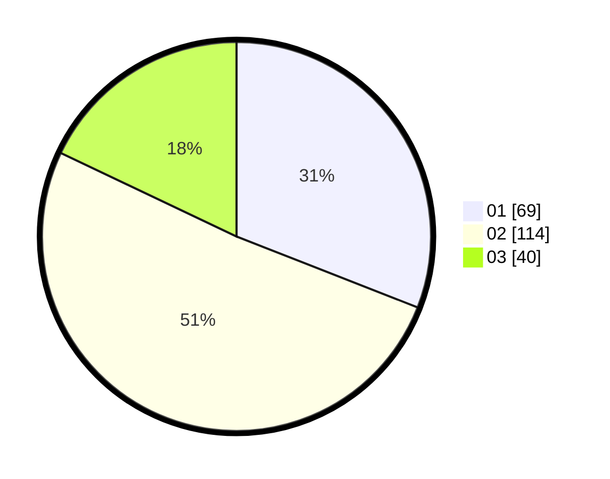

# Hasil

Hasil perolehan suara paslon dapat dilihat pada file paslon-01.txt, paslon-02.txt, dan paslon-03.txt.

Jika tidak ada, artinya data tersebut belum ada pada SIREKAP.

## Perolehan Suara

 * Paslon 01: **69**.
 * Paslon 02: **114**.
 * Paslon 03: **40**.

## Foto C Plano

https://sirekap-obj-formc.kpu.go.id/8edd/pemilu/ppwp/31/73/02/10/06/3173021006053-20240214-204012--27be9be5-a050-47fb-9f86-88b4ab3a76fc.jpg

https://sirekap-obj-formc.kpu.go.id/8edd/pemilu/ppwp/31/73/02/10/06/3173021006053-20240214-204542--335292c1-6423-4904-a909-7fbdfd38458a.jpg

https://sirekap-obj-formc.kpu.go.id/8edd/pemilu/ppwp/31/73/02/10/06/3173021006053-20240214-204625--23dd5711-d518-4122-abe3-d27f65f8dc95.jpg

## DATA PEMILIH TETAP

Jumlah pemilih dalam DPT: **300**.
 * L: **160**.
 * P: **140**.

## DATA PENGGUNA HAK PILIH

Jumlah pengguna hak pilih dalam DPT: **224**.
 * L: **113**.
 * P: **111**.

Jumlah pengguna hak pilih dalam DPTb: **2**.
 * L: **1**.
 * P: **1**.

Jumlah pengguna hak pilih dalam DPK: **2**.
 * L: **1**.
 * P: **1**.

Jumlah pengguna hak pilih: **228**.
 * L: **2**.
 * P: **2**.

## JUMLAH SUARA SAH DAN TIDAK SAH

JUMLAH SELURUH SUARA SAH: **223**.

JUMLAH SUARA TIDAK SAH: **5**.

JUMLAH SELURUH SUARA SAH DAN SUARA TIDAK SAH: **228**.
