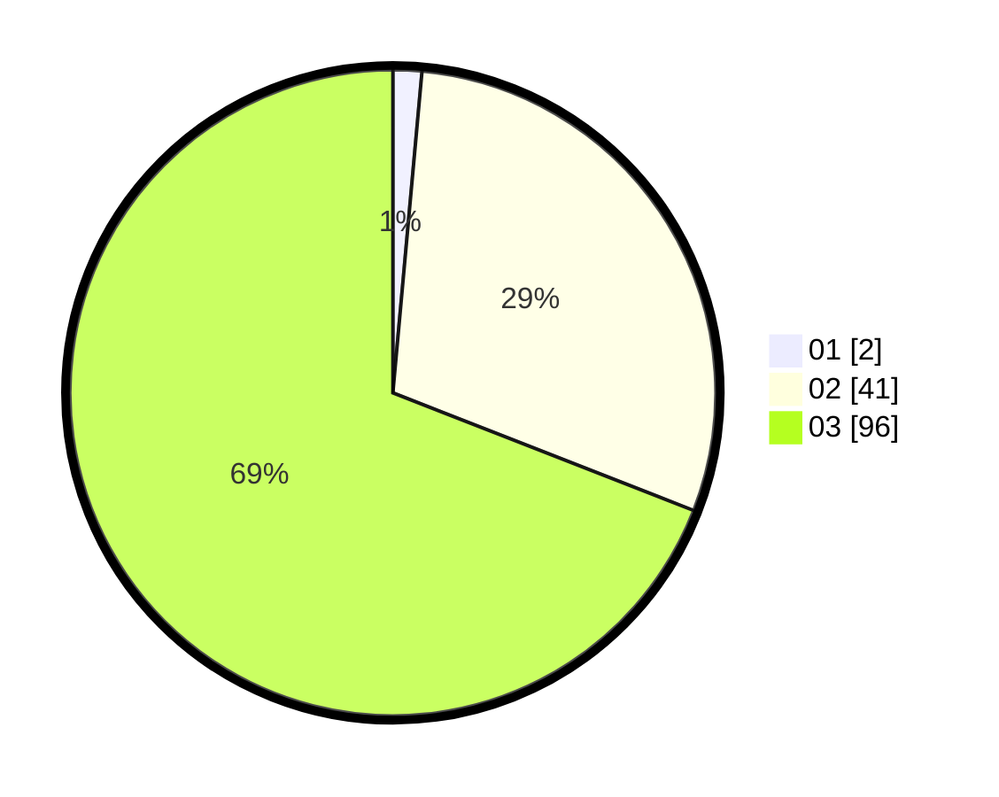

# Hasil

Hasil perolehan suara paslon dapat dilihat pada file paslon-01.txt, paslon-02.txt, dan paslon-03.txt.

Jika tidak ada, artinya data tersebut belum ada pada SIREKAP.

## Perolehan Suara

 * Paslon 01: **2**.
 * Paslon 02: **41**.
 * Paslon 03: **96**.

## Foto C Plano

https://sirekap-obj-formc.kpu.go.id/e1ed/pemilu/ppwp/31/73/02/10/06/3173021006060-20240214-215159--372b7fb9-392a-4ff4-a3b1-1aba0209c80d.jpg

https://sirekap-obj-formc.kpu.go.id/e1ed/pemilu/ppwp/31/73/02/10/06/3173021006060-20240214-215207--b1faa60f-9655-4c0f-8403-862eddeaf033.jpg

https://sirekap-obj-formc.kpu.go.id/e1ed/pemilu/ppwp/31/73/02/10/06/3173021006060-20240214-215217--da2d5fde-5068-477c-bfee-ee80d6165da6.jpg
