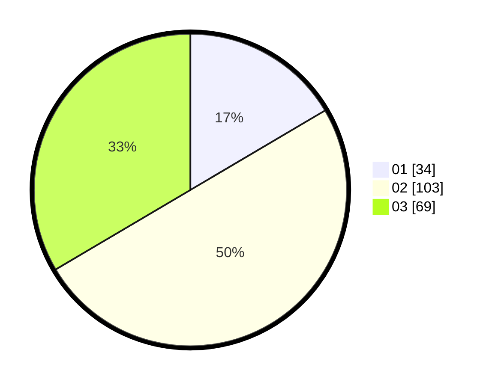

# Hasil

Hasil perolehan suara paslon dapat dilihat pada file paslon-01.txt, paslon-02.txt, dan paslon-03.txt.

Jika tidak ada, artinya data tersebut belum ada pada SIREKAP.

## Perolehan Suara

 * Paslon 01: **34**.
 * Paslon 02: **103**.
 * Paslon 03: **69**.

## Foto C Plano

https://sirekap-obj-formc.kpu.go.id/8648/pemilu/ppwp/31/73/02/10/06/3173021006069-20240214-233714--6090fa1f-e524-4a6b-a6cc-96de90b47cf0.jpg

https://sirekap-obj-formc.kpu.go.id/8648/pemilu/ppwp/31/73/02/10/06/3173021006069-20240214-234314--e582630f-74df-4215-9341-a72e926cbd3b.jpg

https://sirekap-obj-formc.kpu.go.id/8648/pemilu/ppwp/31/73/02/10/06/3173021006069-20240214-234011--d08f5544-d956-44f0-ae9b-22f60d8aadbc.jpg
