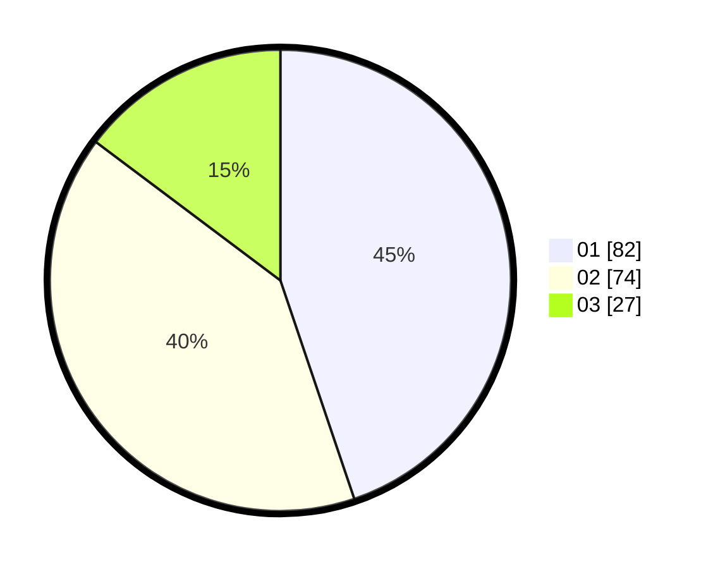

# Hasil

Hasil perolehan suara paslon dapat dilihat pada file paslon-01.txt, paslon-02.txt, dan paslon-03.txt.

Jika tidak ada, artinya data tersebut belum ada pada SIREKAP.

## Perolehan Suara

 * Paslon 01: **82**.
 * Paslon 02: **74**.
 * Paslon 03: **27**.

## Foto C Plano

https://sirekap-obj-formc.kpu.go.id/8691/pemilu/ppwp/31/73/02/10/06/3173021006074-20240214-214828--a8e8afb6-bc2f-48d3-ab6a-d9c11e8e46c6.jpg

https://sirekap-obj-formc.kpu.go.id/8691/pemilu/ppwp/31/73/02/10/06/3173021006074-20240214-205547--9929b9fd-f3b4-46a8-b55f-8bead209b963.jpg

https://sirekap-obj-formc.kpu.go.id/8691/pemilu/ppwp/31/73/02/10/06/3173021006074-20240214-205633--fa601264-ed60-4f70-a9b5-6a10943c9237.jpg
