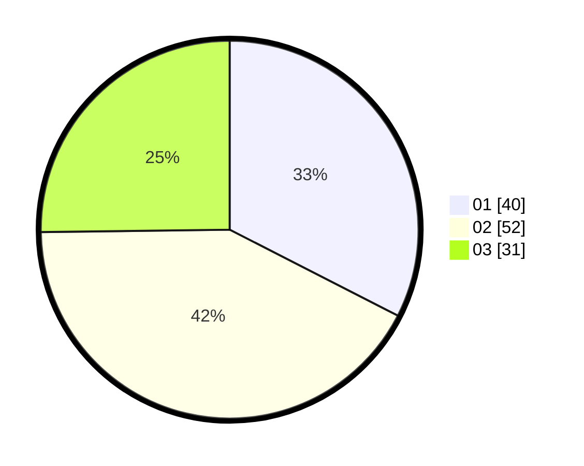

# Hasil

Hasil perolehan suara paslon dapat dilihat pada file paslon-01.txt, paslon-02.txt, dan paslon-03.txt.

Jika tidak ada, artinya data tersebut belum ada pada SIREKAP.

## Perolehan Suara

 * Paslon 01: **40**.
 * Paslon 02: **52**.
 * Paslon 03: **31**.

## Foto C Plano

https://sirekap-obj-formc.kpu.go.id/b197/pemilu/ppwp/31/73/02/10/06/3173021006075-20240214-155239--67abbaa3-ce5f-4887-829b-6188db694990.jpg

https://sirekap-obj-formc.kpu.go.id/b197/pemilu/ppwp/31/73/02/10/06/3173021006075-20240214-155345--77388bfd-4a2a-495b-9e19-08e7bbb36513.jpg

https://sirekap-obj-formc.kpu.go.id/b197/pemilu/ppwp/31/73/02/10/06/3173021006075-20240214-155627--bb314411-bb31-4bf6-9406-fab75cfe5b11.jpg

## DATA PEMILIH TETAP

Jumlah pemilih dalam DPT: **251**.
 * L: **130**.
 * P: **121**.

## DATA PENGGUNA HAK PILIH

Jumlah pengguna hak pilih dalam DPT: **125**.
 * L: **58**.
 * P: **67**.

Jumlah pengguna hak pilih dalam DPTb: **1**.
 * L: **1**.
 * P: **0**.

Jumlah pengguna hak pilih dalam DPK: **0**.
 * L: **0**.
 * P: **0**.

Jumlah pengguna hak pilih: **126**.
 * L: **59**.
 * P: **67**.

## JUMLAH SUARA SAH DAN TIDAK SAH

JUMLAH SELURUH SUARA SAH: **123**.

JUMLAH SUARA TIDAK SAH: **3**.

JUMLAH SELURUH SUARA SAH DAN SUARA TIDAK SAH: **126**.
