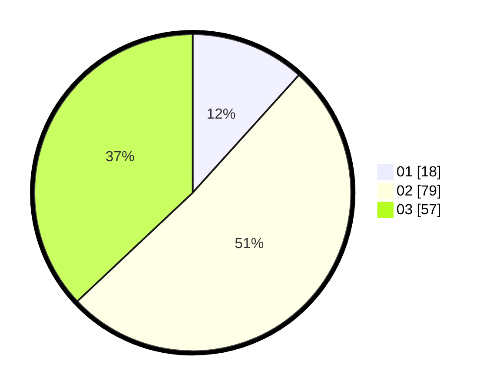

# Hasil

Hasil perolehan suara paslon dapat dilihat pada file paslon-01.txt, paslon-02.txt, dan paslon-03.txt.

Jika tidak ada, artinya data tersebut belum ada pada SIREKAP.

## Perolehan Suara

 * Paslon 01: **18**.
 * Paslon 02: **79**.
 * Paslon 03: **57**.

## Foto C Plano

https://sirekap-obj-formc.kpu.go.id/f49c/pemilu/ppwp/31/73/02/10/06/3173021006078-20240216-141716--fa1f90af-fa07-44b4-8f26-871cc304d9d7.jpg

https://sirekap-obj-formc.kpu.go.id/f49c/pemilu/ppwp/31/73/02/10/06/3173021006078-20240216-141717--a010b9a9-a580-49eb-b33c-8d401d3f6c30.jpg

https://sirekap-obj-formc.kpu.go.id/f49c/pemilu/ppwp/31/73/02/10/06/3173021006078-20240216-141717--8ae0f6aa-fe2e-4543-8c9b-4f933b445765.jpg

## DATA PEMILIH TETAP

Jumlah pemilih dalam DPT: **209**.
 * L: **98**.
 * P: **111**.

## DATA PENGGUNA HAK PILIH

Jumlah pengguna hak pilih dalam DPT: **156**.
 * L: **69**.
 * P: **87**.

Jumlah pengguna hak pilih dalam DPTb: **1**.
 * L: **1**.
 * P: **0**.

Jumlah pengguna hak pilih dalam DPK: **1**.
 * L: **1**.
 * P: **0**.

Jumlah pengguna hak pilih: **158**.
 * L: **71**.
 * P: **87**.

## JUMLAH SUARA SAH DAN TIDAK SAH

JUMLAH SELURUH SUARA SAH: **154**.

JUMLAH SUARA TIDAK SAH: **4**.

JUMLAH SELURUH SUARA SAH DAN SUARA TIDAK SAH: **158**.
